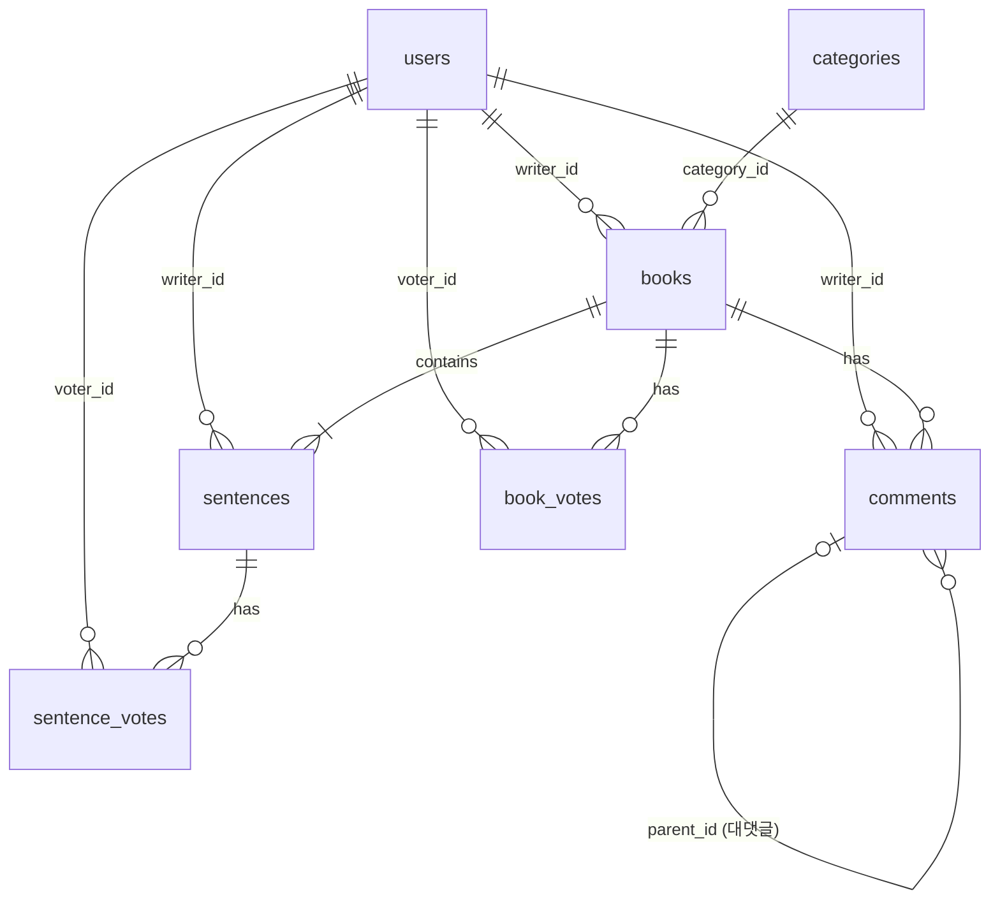

# 🧑‍💻 Next Page Developer Guide

본 가이드는 **Next Page** 프로젝트의 개발자들이 참고할 수 있는 **아키텍처, 기능 명세, 개발 가이드** 문서입니다.

**문서 구조:**

- **PART 1: 공통 (Common)** - 프로젝트 전반에 적용되는 규칙과 요구사항
- **PART 2: AS-IS (Monolithic)** - 초기 단일 애플리케이션 아키텍처
- **PART 3: TO-BE (MSA)** - Microservices Architecture 전환 (현재 운영)

---

# 📑 Table of Contents

## PART 1: 공통 (Common)

1. [Coding Conventions & Patterns](#part-1-1-coding-conventions--patterns)
2. [기능 요구사항](#part-1-2-기능-요구사항)
3. [도메인 모델 & ERD](#part-1-3-도메인-모델--erd)
4. [API Testing Guide](#part-1-4-api-testing-guide)

## PART 2: AS-IS (Monolithic Architecture)

1. [Monolithic 구조 개요](#part-2-1-monolithic-구조-개요)
2. [Monolithic 실행 방법](#part-2-2-monolithic-실행-방법)
3. [Monolithic 패키지 구조](#part-2-3-monolithic-패키지-구조)

## PART 3: TO-BE (MSA Architecture) ✅ 현재 운영

1. [MSA 전환 개요](#part-3-1-msa-전환-개요)
2. [MSA 아키텍처 구조](#part-3-2-msa-아키텍처-구조)
3. [MSA 실행 방법](#part-3-3-msa-실행-방법)
4. [서비스별 상세 가이드](#part-3-4-서비스별-상세-가이드)
5. [Monolithic → MSA 전환 상세](#part-3-5-monolithic--msa-전환-상세)
6. [MSA 개발 가이드](#part-3-6-msa-개발-가이드)

---

# PART 1: 공통 (Common)

프로젝트 전반에 적용되는 코딩 규칙, 요구사항, 도메인 설계를 다룹니다.

---

## PART 1-1. Coding Conventions & Patterns

### 1-1-1. CQRS Pattern (Command Query Responsibility Segregation)

**모든 아키텍처(Monolithic/MSA)에서 일관되게 적용**

#### Command (쓰기)

- **책임:** 데이터 상태를 변경하는 모든 로직
- **기술 스택:** JPA + Hibernate
- **위치:** `command` 패키지
- **특징:**
  - Entity의 비즈니스 메서드를 통해 상태 변경 (Setter 지양)
  - Transaction 관리
  - Domain Logic 포함

```java
// Command 예시
@Service
@Transactional
public class BookService {
    public void createBook(CreateBookRequest request) {
        Book book = Book.builder()
            .title(request.getTitle())
            .writerId(SecurityUtil.getCurrentUserId())
            .build();
        bookRepository.save(book);
    }
}
```

#### Query (읽기)

- **책임:** 데이터 조회 (화면 표시, 통계, 검색)
- **기술 스택:** MyBatis
- **위치:** `query` 패키지
- **특징:**
  - 복잡한 JOIN, 통계 쿼리 최적화
  - DTO 직접 매핑으로 성능 향상
  - 읽기 전용 (`@Transactional(readOnly = true)`)

```java
// Query 예시
@Service
@Transactional(readOnly = true)
public class BookQueryService {
    public List<BookDto> getBookList(BookSearchCriteria criteria) {
        return bookMapper.findBooksByCriteria(criteria);
    }
}
```

### 1-1-2. WebSocket Convention

- **Prefix:**
  - 클라이언트 → 서버: `/app/*`
  - 서버 → 클라이언트: `/topic/*`
- **Payload:** 모든 메시지는 JSON 포맷
- **예시:**

  ```javascript
  // 클라이언트 전송
  stompClient.send("/app/typing", {}, JSON.stringify({bookId: 1, nickname: "홍길동"}));

  // 서버 구독
  stompClient.subscribe("/topic/typing", (message) => {
      console.log(JSON.parse(message.body));
  });
  ```

### 1-1-3. Security Utils

```java
// 현재 로그인한 사용자 ID 획득 (Monolithic/MSA 모두 사용)
Long userId = SecurityUtil.getCurrentUserId();
String email = SecurityUtil.getCurrentUserEmail();
```

**주의:** 하드코딩된 ID 대신 반드시 동적 ID 사용

### 1-1-4. Resilience Patterns (Circuit Breaker)

**MSA 환경에서의 장애 전파 방지**

- **기술:** Resilience4j
- **적용:** Feign Client 호출 부
- **설정 예시 (`application.yml`):**

```yaml
resilience4j:
  circuitbreaker:
    instances:
      memberService:
        registerHealthIndicator: true
        slidingWindowSize: 10
        failureRateThreshold: 50
        waitDurationInOpenState: 5s
```

- **Fallback 패턴:**
  - 타 서비스 장애 시 기본값 반환 ("Unknown User", 빈 리스트 등)
  - 예외를 그대로 던지지 않고 부드러운 실패(Graceful Degradation) 처리

---

## PART 1-2. 팀원 및 역할 분담 (수정됨)

| 이름 | 포지션 | 담당 도메인 & 핵심 역할 |
|:---:|:---:|:---|
| **정진호** | **Team Leader** | **🏛 Core & Architecture**<br>- 프로젝트 아키텍처 설계 (CQRS, WebSocket, MSA 전환)<br>- 실시간 타이핑 및 알림 시스템 구현<br>- `Story` 애그리거트 상태/순서 제어 로직<br>**✍️ Writing & Query**<br>- 문장 작성(Append) 및 유효성 검사<br>- 동적 쿼리(MyBatis) 기반 조회/검색 최적화 |
| **김태형** | **Sub Leader** | **🔐 Member & Auth**<br>- Spring Security + JWT 인증/인가 시스템<br>- **Soft Delete**를 적용한 안전한 회원 탈퇴/관리<br>- 실시간 유효성 검증 로직 및 마이페이지<br>- MSA: member-service 구축 및 Internal API 제공 |
| **정병진** | **Developer** | **❤️ Reaction & Support**<br>- **개추/비추(Thumb Up/Down)** 투표 시스템<br>- 계층형 댓글(대댓글) 구조 설계 및 구현<br>- 관리자 권한(댓글/유저 관리) 기능 구현<br>- MSA: reaction-service 구축 및 양방향 Feign 통합 |
| **최현지** | **Document Manager** | **📄 Documentation & QA**<br>- 프로젝트 문서화 및 리드미(README) 관리<br>- API 명세 및 개발자 가이드 최신화<br>- 전체 기능 QA 및 시나리오 점검 |

---

## PART 1-5. 요구사항 정의서

구글 시트 등에서 활용할 수 있도록, 구현된 모든 기능을 상세하게 나열했습니다.

### 📋 기능 요구사항 (Functional Requirements)

| 클래스 | ID | 대분류 | 요구사항 명 | 상세 내용 | 비고 |
|:---:|:---:|:---:|:---:|:---|:---|
| **Member** | **FR-101** | 회원 | 회원가입 | 이메일, 비밀번호, 닉네임 입력 및 유효성 검사 (이메일 형식, 비밀번호 복잡도) | 실시간 중복체크 |
| **Member** | **FR-102** | 회원 | 로그인 | 이메일/비밀번호 기반 인증 및 JWT Access Token 발급 | 유효기간 1시간 |
| **Member** | **FR-103** | 회원 | 자동 로그인 | Refresh Token(Cookie)을 이용한 Access Token 재발급 (Silent Refresh) | 유효기간 7일 |
| **Member** | **FR-104** | 회원 | 로그아웃 | Refresh Token 무효화 및 쿠키 삭제 처리 | - |
| **Member** | **FR-105** | 회원 | 회원 탈퇴 | DB 데이터 삭제 대신 상태값 변경 (Soft Delete)으로 이력 보존 | 재가입 제한 등 가능 |
| **Member** | **FR-106** | 회원 | 마이페이지 | 내 정보(닉네임, 이메일) 및 활동 요약(작성 수, 받은 좋아요 등) 조회 | - |
| **Member** | **FR-107** | 회원 | 내 활동 조회 | 내가 쓴 소설, 내가 쓴 문장, 내가 쓴 댓글 탭 분리 페이징 조회 | - |
| **Story** | **FR-201** | 소설 | 소설 생성 | 제목, 카테고리(장르), 최대 문장 수 설정을 통한 방 개설 | - |
| **Story** | **FR-202** | 소설 | 소설 목록 조회 | 최신순/인기순 정렬, 카테고리 필터링, 검색어(제목/내용) 기반 조회 | 무한 스크롤 적용 |
| **Story** | **FR-203** | 소설 | 소설 상세 조회 | 소설 기본 정보, 참여 작가 목록, 현재 진행 상태 조회 | - |
| **Story** | **FR-204** | 소설 | 문장 이어쓰기 | 현재 순서(Sequence)에 맞춰 새로운 문장 등록 (이전 작성자 작성 불가) | 길이 제한 검증 |
| **Story** | **FR-205** | 소설 | 문장 수정 | 자신이 작성한 **마지막 문장**에 한해 내용 수정 가능 | 중간 문장 수정 불가 |
| **Story** | **FR-206** | 소설 | 문장 삭제 | 자신이 작성한 **마지막 문장**에 한해 삭제 가능 (순서 롤백) | - |
| **Story** | **FR-207** | 소설 | 소설 정보 수정 | 소설 제목 등 메타데이터 수정 (방장 권한) | - |
| **Story** | **FR-208** | 소설 | 소설 삭제 | 소설 전체 삭제 (방장 권한) - 관련된 문장/댓글 일괄 삭제(Soft) | - |
| **Story** | **FR-209** | 소설 | 뷰어 모드 | 완결된 소설의 전체 문장을 책 넘김 효과(flip) 또는 스크롤로 열람 | - |
| **Story** | **FR-210** | 소설 | 수동 완결 | 최대 문장 수 도달 전, 방장이 임의로 소설 완결 처리 가능 | - |
| **Story** | **FR-211** | 소설 | 자동 완결 | 설정된 최대 문장 수 도달 시 자동으로 상태 변경 (COMPLETED) | - |
| **Reaction** | **FR-301** | 반응 | 댓글 작성 | 특정 소설에 대한 의견(댓글) 등록 | - |
| **Reaction** | **FR-302** | 반응 | 대댓글 작성 | 특정 댓글에 대한 답글(Reply) 등록 (계층형 구조) | - |
| **Reaction** | **FR-303** | 반응 | 댓글 수정/삭제 | 본인이 작성한 댓글 내용 수정 및 삭제 (Soft Delete) | - |
| **Reaction** | **FR-304** | 반응 | 소설 투표 | 소설 전체에 대한 개추(Like) / 비추(Dislike) 투표 (토글 방식) | 1인 1투표 |
| **Reaction** | **FR-305** | 반응 | 문장 투표 | 특정 문장에 대한 개추/비추 투표 (베스트 문장 선정 활용) | - |
| **Realtime** | **FR-401** | 실시간 | 타이핑 알림 | 특정 유저가 문장을 작성 중일 때 실시간으로 "OOO님이 작성 중..." 표시 | WebSocket |
| **Realtime** | **FR-402** | 실시간 | 댓글 알림 | 특정 유저가 댓글을 작성 중일 때 실시간 타이핑 인디케이터 표시 | WebSocket |
| **Realtime** | **FR-403** | 실시간 | 라이브 업데이트 | 다른 유저가 문장/댓글 등록 시 새로고침 없이 화면에 즉시 반영 | WebSocket |
| **Admin** | **FR-901** | 관리자 | 유저 관리 | 악성 유저 강제 탈퇴 및 정지 처리 | - |
| **Admin** | **FR-902** | 관리자 | 콘텐츠 관리 | 부적절한 소설/문장/댓글 강제 블라인드 또는 삭제 처리 | - |

### 🛡️ 비기능 요구사항 (Non-Functional Requirements)

| ID | 분류 | 요구사항 명 | 상세 내용 |
|:---:|:---:|:---:|:---|
| **NFR-101** | **Security** | 비밀번호 암호화 | 사용자의 비밀번호는 BCrypt 등 단방향 해시 함수로 암호화하여 저장해야 한다. |
| **NFR-102** | **Security** | 인증 보안 | 모든 API 요청은 Stateless한 JWT로 인증하며, Refresh Token은 HttpOnly Cookie로 관리한다. |
| **NFR-103** | **Security** | 접근 제어 | 작성자 본인만 수정/삭제 가능하도록 ID 기반의 권한 검증 로직(Guard)을 포함해야 한다. |
| **NFR-201** | **Performance** | DB 최적화 | 복잡한 조회(목록, 통계)는 MyBatis Dynamic SQL을 사용하고, 쓰기는 JPA를 사용하여 성능과 정합성을 모두 잡는다. |
| **NFR-202** | **Performance** | N+1 방지 | JPA 연관관계 조회 시 Fetch Join 또는 Batch Size를 적용하거나, MSA 환경에선 Batch API를 사용한다. |
| **NFR-301** | **Architecture** | 서비스 독립성 | MSA 환경에서 한 서비스(예: Reaction)가 다운되어도 핵심 서비스(Story)는 정상 동작해야 한다. |
| **NFR-302** | **Architecture** | 데이터 분리 | 각 마이크로서비스는 고유의 데이터베이스 스키마를 가지며, 타 서비스 DB에 직접 접근하지 않는다. |
| **NFR-303** | **Architecture** | API Gateway | 모든 클라이언트 요청은 단일 진입점(Gateway)을 거치며, 여기서 인증/인가 및 라우팅을 수행한다. |
| **NFR-401** | **UX/UI** | 반응형 웹 | PC, 태블릿, 모바일 등 다양한 해상도에서 깨짐 없이 UI가 제공되어야 한다. |
| **NFR-402** | **UX/UI** | 피드백 제공 | 사용자의 모든 액션(성공, 실패, 로딩)에 대해 즉각적인 시각적 피드백(Toast, Spinner)을 제공해야 한다. |
| **NFR-501** | **Standard** | API 명세 | 모든 API는 Swagger(OpenAPI 3.0)를 통해 문서화되고 테스트 가능해야 한다. |
| **NFR-502** | **Standard** | 코드 품질 | Checkstyle 및 Google Java Style Guide를 준수하여 일관된 코드 스타일을 유지한다. |

---

## PART 1-3. 도메인 모델 & ERD

### 핵심 도메인 엔티티

#### 1. User (회원)

- **PK:** `user_id`
- **UK:** `user_email`, `user_nicknm`
- **Soft Delete:** `user_status` (ACTIVE/DELETED), `left_at`
- **역할:** `user_role` (USER/ADMIN)

#### 2. Book (소설)

- **PK:** `book_id`
- **FK:** `writer_id` (User), `category_id` (Category)
- **상태:** `status` (WRITING/COMPLETED)
- **순서 제어:** `current_sequence`, `max_sequence`, `last_writer_user_id`

#### 3. Sentence (문장)

- **PK:** `sentence_id`
- **FK:** `book_id` (Book), `writer_id` (User)
- **순서:** `sequence_no`

#### 4. Comment (댓글)

- **PK:** `comment_id`
- **FK:** `book_id` (Book), `writer_id` (User), `parent_id` (Comment - 대댓글)
- **Soft Delete:** `deleted_at`

#### 5. Vote (투표)

- **BookVote:** 소설에 대한 투표
- **SentenceVote:** 문장에 대한 투표
- **제약:** 1인 1투표 (`UNIQUE KEY`)

### ERD (Entity Relationship Diagram)



---

## PART 1-4. API Testing Guide

### 방법 1: Swagger UI ✅ 권장

**Monolithic:**

- URL: `http://localhost:8080/swagger-ui/index.html`

**MSA:**

- Gateway: `http://localhost:8000` (통합 라우팅)
- Member Service: `http://localhost:8081/swagger-ui.html`
- Story Service: `http://localhost:8082/swagger-ui.html`
- Reaction Service: `http://localhost:8083/swagger-ui.html`

### 방법 2: IntelliJ HTTP Client

**파일 위치:**

- Monolithic: `next-page/http/api-test.http`
- MSA: `next-page-msa/http/msa-api-test.http`

**사용법:**

1. IntelliJ에서 `.http` 파일 열기
2. `Run` 버튼(▶️) 클릭하여 요청 전송
3. 환경 변수로 JWT 토큰 자동 관리

**예시:**

```http
### 1. 회원가입
POST http://localhost:8000/api/auth/signup
Content-Type: application/json

{
  "userEmail": "test@example.com",
  "userPw": "password123",
  "userNicknm": "테스터"
}

### 2. 로그인
POST http://localhost:8000/api/auth/login
Content-Type: application/json

{
  "userEmail": "test@example.com",
  "userPw": "password123"
}

> 

### 3. 소설 생성 (JWT 필요)
POST http://localhost:8000/api/books
Authorization: Bearer {{accessToken}}
Content-Type: application/json

{
  "title": "테스트 소설",
  "categoryId": "THRILLER",
  "maxSequence": 10
}
```

---

# PART 2: AS-IS (Monolithic Architecture)

초기 버전의 단일 애플리케이션 아키텍처 (2025.12.23 ~ 2026.01.10)

---

## PART 2-1. Monolithic 구조 개요

### 아키텍처 다이어그램

```
┌─────────────────────────────────────┐
│         Client (Browser)            │
└──────────────┬──────────────────────┘
               │ HTTP/WebSocket
               ↓
┌─────────────────────────────────────┐
│    Spring Boot Application          │
│         (Port: 8080)                │
│                                     │
│  ┌─────────────────────────────┐   │
│  │   Spring Security + JWT     │   │
│  └─────────────────────────────┘   │
│                                     │
│  ┌─────────────────────────────┐   │
│  │   REST Controllers          │   │
│  │   - MemberController        │   │
│  │   - BookController          │   │
│  │   - ReactionController      │   │
│  └─────────────────────────────┘   │
│                                     │
│  ┌─────────────────────────────┐   │
│  │   Service Layer             │   │
│  │   - Command (JPA)           │   │
│  │   - Query (MyBatis)         │   │
│  └─────────────────────────────┘   │
│                                     │
│  ┌─────────────────────────────┐   │
│  │   WebSocket (STOMP)         │   │
│  │   - /topic/typing           │   │
│  │   - /topic/books            │   │
│  └─────────────────────────────┘   │
└──────────────┬──────────────────────┘
               │ JDBC
               ↓
┌─────────────────────────────────────┐
│    MariaDB (Single Database)        │
│         next_page                   │
│                                     │
│  - users                            │
│  - books                            │
│  - sentences                        │
│  - comments                         │
│  - votes                            │
└─────────────────────────────────────┘
```

### 특징

✅ **장점:**

- 단순한 배포 (단일 JAR 파일)
- 트랜잭션 관리 용이 (단일 DB)
- 개발 초기 빠른 프로토타이핑

❌ **단점:**

- 서비스 간 결합도 높음
- 확장성 제한 (Scale-out 어려움)
- 장애 격리 불가 (부분 장애 시 전체 영향)
- 대규모 팀 협업 어려움

---

## PART 2-2. Monolithic 실행 방법

### 전제 조건

- JDK 17+
- MariaDB 10.6+
- Gradle

### 데이터베이스 설정

```sql
-- Database 생성
CREATE DATABASE next_page CHARACTER SET utf8mb4 COLLATE utf8mb4_unicode_ci;

-- User 생성 및 권한 부여
CREATE USER 'nextpage'@'localhost' IDENTIFIED BY 'nextpage_pw_2026';
GRANT ALL PRIVILEGES ON next_page.* TO 'nextpage'@'localhost';
FLUSH PRIVILEGES;
```

### 실행

```bash
cd next-page
./gradlew bootRun
```

**접속:**

- API: `http://localhost:8080`
- Swagger: `http://localhost:8080/swagger-ui/index.html`
- H2 Console (개발 시): `http://localhost:8080/h2-console`

---

## PART 2-3. Monolithic 패키지 구조

```text
next-page/src/main/java/com/team2/nextpage
│
├── 📂 auth                       // 🔐 인증 (JWT, UserDetails)
│   ├── JwtTokenProvider.java
│   ├── CustomUserDetails.java
│   └── CustomUserDetailsService.java
│
├── 📂 config                     // ⚙️ 설정
│   ├── SecurityConfig.java       // Spring Security
│   ├── WebSocketConfig.java     // STOMP
│   └── SwaggerConfig.java       // API 문서
│
├── 📂 common                     // 🧰 공통
│   ├── exception/               // 예외 처리
│   ├── response/                // API 응답 포맷
│   └── utils/                   // SecurityUtil 등
│
├── 📂 command                    // ✏️ Command (CUD)
│   ├── 📂 member                 // 회원 Command
│   │   ├── controller/
│   │   ├── service/
│   │   ├── repository/
│   │   ├── entity/              // JPA Entity
│   │   └── dto/
│   │
│   ├── 📂 book                   // 소설 Command
│   │   ├── controller/
│   │   ├── service/
│   │   ├── repository/
│   │   ├── entity/
│   │   └── dto/
│   │
│   └── 📂 reaction               // 반응 Command
│       ├── controller/
│       ├── service/
│       ├── repository/
│       ├── entity/
│       └── dto/
│
├── 📂 query                      // 📖 Query (Read)
│   ├── 📂 member                 // 회원 Query
│   │   ├── controller/
│   │   ├── service/
│   │   ├── mapper/              // MyBatis Mapper
│   │   └── dto/
│   │
│   ├── 📂 book                   // 소설 Query
│   │   ├── controller/
│   │   ├── service/
│   │   ├── mapper/
│   │   └── dto/
│   │
│   └── 📂 reaction               // 반응 Query
│       ├── controller/
│       ├── service/
│       ├── mapper/
│       └── dto/
│
└── 📂 websocket                  // ⚡ Real-time
    ├── config/
    ├── controller/
    └── dto/

next-page/src/main/resources
├── application.yml               // 설정 파일
├── mapper/                       // MyBatis XML
│   ├── member/
│   ├── book/
│   └── reaction/
└── static/                       // 정적 리소스
```

---

# PART 3: TO-BE (MSA Architecture) ✅ 현재 운영

Microservices Architecture 전환 (2026.01.11 ~)

---

## PART 3-1. MSA 전환 개요

### 전환 배경

#### Monolithic의 한계

1. **확장성:** 특정 기능만 스케일링 불가
2. **장애 격리:** 부분 장애 시 전체 시스템 다운
3. **배포:** 작은 변경도 전체 재배포 필요
4. **팀 협업:** 도메인별 독립 개발 어려움

#### MSA 도입 목표

1. **서비스별 독립 배포**
2. **기술 스택 유연성**
3. **장애 격리 및 회복탄력성**
4. **도메인 중심 팀 구조**

### 전환 일정

| 날짜 | 작업 | 상태 |
|:---:|:---|:---:|
| 2026-01-11 | Discovery Server, Gateway 구축 | ✅ |
| 2026-01-12 | DB 3개 분리 (member, story, reaction) | ✅ |
| 2026-01-13 | member-service 이관 | ✅ |
| 2026-01-14 | story-service, reaction-service 이관 | ✅ |
| 2026-01-15 | Feign Client 구현, 전체 빌드 성공 | ✅ |
| 2026-01-16 | Circuit Breaker (Resilience4j) 적용 | ✅ |

---

## PART 3-2. MSA 아키텍처 구조

### 시스템 구성도

```
                    [Eureka Discovery Server]
                           Port: 8761
                      (서비스 등록/탐색)
                                │
                    [API Gateway Server]
                         Port: 8000
                  (JWT 검증, 라우팅, 헤더 주입)
                                │
            ┌───────────────────┼───────────────────┐
            │                   │                   │
    [Member Service]    [Story Service]    [Reaction Service]
       Port: 8081          Port: 8082          Port: 8083
            │                   │                   │
    [DB: member]         [DB: story]        [DB: reaction]
    - users              - books            - comments
    - refresh_tokens     - sentences        - book_votes
                         - categories       - sentence_votes
            │                   │                   │
            └───────────────────┴───────────────────┘
                    Feign Client 통신 (동기 REST)
```

### 서비스별 책임

#### 1. Discovery Server (Eureka)

- **포트:** 8761
- **역할:** 서비스 등록 및 탐색
- **기술:** Spring Cloud Netflix Eureka

#### 2. API Gateway

- **포트:** 8000
- **역할:**
  - JWT 토큰 검증
  - 요청 라우팅
  - HTTP 헤더 주입 (X-User-Id, X-User-Email 등)
  - CORS 처리
- **기술:** Spring Cloud Gateway

#### 3. Member Service

- **포트:** 8081
- **DB:** `next_page_member`
- **책임:**
  - 회원가입/로그인
  - JWT 토큰 발급/갱신
  - 회원 정보 관리
  - Soft Delete 처리
- **제공 API:**
  - 외부: `/api/auth/**`, `/api/members/**`
  - 내부: `/internal/members/**` (Feign 전용)

#### 4. Story Service

- **포트:** 8082
- **DB:** `next_page_story`
- **책임:**
  - 소설 생성/조회
  - 문장 이어쓰기
  - 순서 제어 로직
  - WebSocket (실시간 타이핑)
- **제공 API:**
  - 외부: `/api/books/**`, `/api/categories/**`
  - 내부: `/internal/books/**` (Feign 전용 - 소설 정보, 문장 ID로 소설 ID 조회 등)

#### 5. Reaction Service

- **포트:** 8083
- **DB:** `next_page_reaction`
- **책임:**
  - 댓글/대댓글 관리
  - 개추/비추 투표
  - Soft Delete (댓글)
- **제공 API:**
  - 외부: `/api/reactions/**`, `/api/votes/**`
  - 내부: (없음)

### 데이터베이스 분리 전략

#### Database per Service 패턴

| 서비스 | 데이터베이스 | 테이블 |
|:---:|:---:|:---|
| **Member** | `next_page_member` | users, refresh_tokens |
| **Story** | `next_page_story` | books, sentences, categories |
| **Reaction** | `next_page_reaction` | comments, book_votes, sentence_votes |

#### 외래키 전략

**Monolithic (AS-IS):**

```sql
-- ✅ DB 내 외래키 제약
ALTER TABLE books
ADD CONSTRAINT fk_books_writer
FOREIGN KEY (writer_id) REFERENCES users(user_id);
```

**MSA (TO-BE):**

```sql
-- ❌ Cross-DB 외래키 제약 없음
-- writer_id는 BIGINT 컬럼으로만 존재
-- 참조 무결성은 Application Level에서 Feign Client로 검증
```

#### 데이터 타입 확장성 개선

MSA 전환 시 **장기 운영 및 대규모 트래픽**을 고려하여 모든 ID 컬럼의 데이터 타입을 변경했습니다.

| 영역 | AS-IS (Monolithic) | TO-BE (MSA) |
|:---|:---:|:---:|
| **DB 컬럼** | `INT` | `BIGINT` |
| **Java Entity** | `Integer` / `Long` 혼용 | `Long` 통일 |
| **최대값** | ~21억 | ~922경 |

**변경된 컬럼 목록:**

```diff
-- 모든 PK 컬럼
- user_id INT NOT NULL AUTO_INCREMENT
+ user_id BIGINT NOT NULL AUTO_INCREMENT

- book_id INT NOT NULL AUTO_INCREMENT
+ book_id BIGINT NOT NULL AUTO_INCREMENT

- sentence_id INT NOT NULL AUTO_INCREMENT
+ sentence_id BIGINT NOT NULL AUTO_INCREMENT

- comment_id INT NOT NULL AUTO_INCREMENT
+ comment_id BIGINT NOT NULL AUTO_INCREMENT

- vote_id INT NOT NULL AUTO_INCREMENT
+ vote_id BIGINT NOT NULL AUTO_INCREMENT

-- 모든 FK 컬럼
- writer_id INT NOT NULL
+ writer_id BIGINT NOT NULL

- voter_id INT NOT NULL
+ voter_id BIGINT NOT NULL
```

**Java Entity 대응:**

```java
// AS-IS (혼용 가능성 있었음)
@Column(name = "user_id")
private Integer userId;  // ❌ INT와 매핑

// TO-BE (통일)
@Column(name = "user_id")
private Long userId;     // ✅ BIGINT와 매핑
```

> [!IMPORTANT]
> **마이그레이션 시 주의사항**
>
> - 기존 Monolithic DB 데이터는 `INT` → `BIGINT` 변환 시 데이터 손실 없음 (업캐스트)
> - DTO, Request/Response 클래스도 `Long` 타입으로 통일 필요
> - MyBatis Mapper의 `resultType`도 일치하도록 확인

---

## PART 3-3. MSA 실행 방법 (상세 가이드)

### 필수 요구사항

- JDK 17+
- MariaDB 10.6+
- Git

### 0단계: 환경 변수 설정 (.env)

`config-server`가 Git 저장소에 접근하기 위해 보안 정보가 필요합니다.
**루트 폴더(`next-page-msa/`)** 에 `.env` 파일을 생성하고 아래 내용을 작성하세요.

```properties
# .env 파일 예시
CONFIG_GIT_URI=https://github.com/fdrn9999/next-page-env
CONFIG_GIT_USERNAME=your_git_username
CONFIG_GIT_PASSWORD=your_git_token
```

> **주의:** 이 파일은 `.gitignore`에 등록되어 있어 커밋되지 않습니다. 로컬 실행 시 필수입니다.

### 1단계: 데이터베이스 설정 (Database Setup)

MSA 환경을 위한 데이터베이스와 계정을 생성합니다. 편리한 관리를 위해 제공된 스크립트를 사용하세요.

**위치:** `next-page-msa/database-scripts/`

#### 1-1. 계정 초기화 (Root 권한)

`root` 계정으로 접속하여 애플리케이션 공용 계정(`swcamp`)을 생성합니다.

```bash
# database-scripts/00-init-roles.sql 실행
mysql -u root -pmariadb < 00-init-roles.sql
```

#### 1-2. 데이터베이스 및 스키마 생성 (swcamp 계정)

`swcamp` 계정으로 나머지 스크립트를 순서대로 실행합니다.

```bash
# 1. DB 생성
mysql -u swcamp -pswcamp < 01-create-databases.sql

# 2. 서비스별 스키마 생성
mysql -u swcamp -pswcamp < 02-member-service-schema.sql
mysql -u swcamp -pswcamp < 03-story-service-schema.sql
mysql -u swcamp -pswcamp < 04-reaction-service-schema.sql
```

> **참고:** Linux/Mac 사용자는 `README.md`에 있는 `script.sh`를, Windows 사용자는 PowerShell 스크립트를 활용하면 한 번에 실행할 수 있습니다.

---

### 2단계: Config Server 실행 (필수)

모든 마이크로서비스는 시작 시 **Config Server**로부터 설정을 받아옵니다. 따라서 가장 먼저 실행되어야 합니다.

- **포트:** 8888
- **설정 저장소:** [https://github.com/fdrn9999/next-page-env](https://github.com/fdrn9999/next-page-env)

```bash
cd next-page-msa/config-server
./gradlew bootRun
```

*확인: `http://localhost:8888/gatewayserver/default` 접속 시 JSON 설정 반환*

---

### 3단계: Discovery Server 실행

서비스 등록 및 탐색을 위한 Eureka 서버를 실행합니다.

- **포트:** 8761

```bash
cd next-page-msa/discovery-server
./gradlew bootRun
```

*확인: `http://localhost:8761` 접속하여 Eureka Dashboard 확인*

---

### 4단계: API Gateway 실행

모든 요청의 진입점인 Gateway를 실행합니다.

- **포트:** 8000

```bash
cd next-page-msa/gateway-server
./gradlew bootRun
```

---

### 5단계: 도메인 서비스 실행

각 비즈니스 로직을 담당하는 마이크로서비스를 실행합니다. 순서는 상관없습니다.

```bash
# 새 터미널 탭을 열어서 각각 실행
cd next-page-msa/member-service && ./gradlew bootRun
cd next-page-msa/story-service && ./gradlew bootRun
cd next-page-msa/reaction-service && ./gradlew bootRun
```

---

### 서비스 상태 확인 목록

| 서비스 | URL | 주요 확인 사항 |
|:---:|:---:|:---|
| **Eureka** | `http://localhost:8761` | GATEWAY-SERVER, MEMBER-SERVICE 등 모든 인스턴스 등록 여부 |
| **Config** | `http://localhost:8888` | 설정 파일 서빙 여부 |
| **Gateway** | `http://localhost:8000/actuator/health` | `UP` 상태 확인 |
| **Swagger** | `http://localhost:8000/webjars/swagger-ui/index.html` | Gateway 통합 Swagger 접속 가능 여부 |

### 모니터링 (Spring Actuator)

각 서비스는 `/actuator` 엔드포인트를 통해 상태 정보를 제공합니다.

- **Health Check:** `http://localhost:[PORT]/actuator/health`
- **Metrics:** `http://localhost:[PORT]/actuator/metrics`
- **Beans:** `http://localhost:[PORT]/actuator/beans`

---

## PART 3-4. 서비스별 상세 가이드

### 📦 common-module

**역할:** 모든 서비스가 공유하는 코드

**포함 내용:**

- Feign Client 인터페이스
- Feign DTOs
- 공통 Exception
- 공통 Response 포맷
- SecurityUtil

**build.gradle:**

```gradle
dependencies {
    // Spring Boot Starters
    api 'org.springframework.boot:spring-boot-starter-web'
    api 'org.springframework.boot:spring-boot-starter-validation'
    api 'org.springframework.boot:spring-boot-starter-data-jpa'

    // Spring Cloud OpenFeign (MSA 통신)
    api 'org.springframework.cloud:spring-cloud-starter-openfeign'

    // ModelMapper (DTO 변환)
    api 'org.modelmapper:modelmapper:3.2.0'

    // Jackson (JSON 처리)
    api 'com.fasterxml.jackson.core:jackson-databind'

    // Lombok
    compileOnly 'org.projectlombok:lombok'
    annotationProcessor 'org.projectlombok:lombok'

    // Slf4j Logging
    api 'org.slf4j:slf4j-api'
}
```

**Feign Client 정의:**

```java
// MemberServiceClient.java
@FeignClient(name = "member-service")
public interface MemberServiceClient {
    @GetMapping("/internal/members/{userId}")
    ApiResponse<MemberInfoDto> getMemberInfo(@PathVariable("userId") Long userId);

    @GetMapping("/internal/members/batch")
    ApiResponse<MemberBatchInfoDto> getMembersBatch(@RequestParam("userIds") List<Long> userIds);

    @GetMapping("/internal/members/{userId}/exists")
    ApiResponse<Boolean> memberExists(@PathVariable("userId") Long userId);
}
```

```java
// StoryServiceClient.java
@FeignClient(name = "story-service")
public interface StoryServiceClient {
    @GetMapping("/internal/books/{bookId}")
    ApiResponse<BookInfoDto> getBookInfo(@PathVariable("bookId") Long bookId);

    @GetMapping("/internal/books/batch")
    ApiResponse<BookBatchInfoDto> getBooksBatch(@RequestParam("bookIds") List<Long> bookIds);

    @GetMapping("/internal/books/{bookId}/exists")
    ApiResponse<Boolean> bookExists(@PathVariable("bookId") Long bookId);
}
```

---

### 🔐 member-service

**담당자:** 김태형

**application.yml:**

```yaml
server:
  port: 8081

spring:
  application:
    name: member-service
  datasource:
    url: jdbc:mariadb://localhost:3306/next_page_member
    username: member_service
    password: member_pw_2026

eureka:
  client:
    service-url:
      defaultZone: http://localhost:8761/eureka/
```

**주요 기능:**

1. 회원가입/로그인 (JWT 발급)
2. Refresh Token 관리
3. 회원 정보 조회/수정
4. Soft Delete 탈퇴 처리

**Internal API (Feign 전용):**

```java
@RestController
@RequestMapping("/internal/members")
@Hidden  // Swagger에서 숨김
public class MemberInternalController {

    @GetMapping("/{userId}")
    public ApiResponse<MemberInfoDto> getMemberInfo(@PathVariable Long userId) {
        // 단일 조회
    }

    @GetMapping("/batch")
    public ApiResponse<MemberBatchInfoDto> getMembersBatch(@RequestParam List<Long> userIds) {
        // 일괄 조회 (N+1 방지)
    }
}
```

---

### 📖 story-service

**담당자:** 정진호

**application.yml:**

```yaml
server:
  port: 8082

spring:
  application:
    name: story-service
  datasource:
    url: jdbc:mariadb://localhost:3306/next_page_story
    username: story_service
    password: story_pw_2026

eureka:
  client:
    service-url:
      defaultZone: http://localhost:8761/eureka/
```

**주요 기능:**

1. 소설 생성/조회
2. 문장 이어쓰기 (순서 제어)
3. WebSocket 실시간 알림
4. Feign Client로 회원 정보 조회

**Feign Client 사용 예시:**

```java
@Service
@RequiredArgsConstructor
public class BookQueryService {
    private final BookMapper bookMapper;
    private final MemberServiceClient memberServiceClient;

    public BookDetailDto getBookForViewer(Long bookId) {
        // 1. 자신의 DB에서 소설 조회
        BookDetailDto book = bookMapper.findBookForViewer(bookId, userId);
        List<SentenceDto> sentences = bookMapper.findSentencesByBookId(bookId, userId);

        // 2. 모든 작성자 ID 수집 (중복 제거)
        List<Long> writerIds = sentences.stream()
            .map(SentenceDto::getWriterId)
            .distinct()
            .collect(Collectors.toList());

        if (book.getWriterId() != null) {
            writerIds.add(book.getWriterId());
        }

        // 3. Feign Client로 일괄 조회 (N+1 방지)
        ApiResponse<MemberBatchInfoDto> response =
            memberServiceClient.getMembersBatch(writerIds);

        // 4. Map으로 변환
        Map<Long, String> memberMap = response.getData().getMembers().stream()
            .collect(Collectors.toMap(
                MemberInfoDto::getUserId,
                MemberInfoDto::getUserNicknm
            ));

        // 5. DTO에 닉네임 설정
        book.setWriterNicknm(memberMap.get(book.getWriterId()));
        sentences.forEach(s -> s.setWriterNicknm(memberMap.get(s.getWriterId())));

        book.setSentences(sentences);
        return book;
    }
}
```

---

### ❤️ reaction-service

**담당자:** 정병진

**application.yml:**

```yaml
server:
  port: 8083

spring:
  application:
    name: reaction-service
  datasource:
    url: jdbc:mariadb://localhost:3306/next_page_reaction
    username: reaction_service
    password: reaction_pw_2026

eureka:
  client:
    service-url:
      defaultZone: http://localhost:8761/eureka/
```

**주요 기능:**

1. 댓글/대댓글 관리
2. 개추/비추 투표
3. 양방향 Feign Client (Member + Story)

**양방향 Feign 사용 예시:**

```java
@Service
@RequiredArgsConstructor
public class ReactionQueryService {
    private final ReactionMapper reactionMapper;
    private final MemberServiceClient memberServiceClient;
    private final StoryServiceClient storyServiceClient;

    public CommentPageResponse getCommentsByUser(Long userId, int page, int size) {
        // 1. 댓글 조회
        List<CommentDto> comments = reactionMapper.findCommentsByWriterId(userId, offset, size);

        // 2. Member Service에서 회원 정보 조회
        ApiResponse<MemberInfoDto> memberResponse = memberServiceClient.getMemberInfo(userId);
        String nicknm = memberResponse.getData().getUserNicknm();
        comments.forEach(comment -> comment.setWriterNicknm(nicknm));

        // 3. Story Service에서 소설 정보 조회
        List<Long> bookIds = comments.stream()
            .map(CommentDto::getBookId)
            .distinct()
            .collect(Collectors.toList());

        ApiResponse<BookBatchInfoDto> bookResponse = storyServiceClient.getBooksBatch(bookIds);
        Map<Long, String> bookMap = bookResponse.getData().getBooks().stream()
            .collect(Collectors.toMap(
                BookInfoDto::getBookId,
                BookInfoDto::getTitle
            ));

        // 4. 소설 제목 설정
        comments.forEach(comment ->
            comment.setBookTitle(bookMap.get(comment.getBookId()))
        );

        return new CommentPageResponse(comments, page, size, totalElements);
    }
}
```

---

## PART 3-5. Monolithic → MSA 전환 상세

### 전환 작업 목록

#### 1. JPA Entity 관계 → ID 참조 전환 ✅

**Before (Monolithic):**

```java
@Entity
@Table(name = "books")
public class Book {
    @ManyToOne(fetch = FetchType.LAZY)
    @JoinColumn(name = "writer_id")
    private Member writer;  // JPA 객체 참조

    public String getWriterNickname() {
        return writer.getUserNicknm();
    }
}
```

**문제점:**

- `Member`는 `next_page_member` DB에, `Book`은 `next_page_story` DB에 있음
- Cross-DB JOIN 불가능
- JPA가 런타임에 에러 발생

**After (MSA):**

```java
@Entity
@Table(name = "books")
public class Book {
    @Column(name = "writer_id")
    private Long writerId;  // ID만 저장

    // 닉네임은 DTO에서 Feign Client로 조회
}
```

**DTO 변환:**

```java
@Getter
@Setter
public class BookDetailDto {
    private Long bookId;
    private String title;
    private Long writerId;
    private String writerNicknm;  // Feign Client로 채워질 필드
}
```

#### 2. MyBatis JOIN 제거 → Application Level Join ✅

**Before (Monolithic):**

```xml
<!-- ❌ Cross-DB JOIN -->
<select id="findBookForViewer" resultType="BookDetailDto">
    SELECT
        b.book_id,
        b.title,
        u.user_nicknm AS writerNicknm  <!-- users 테이블 JOIN -->
    FROM books b
    LEFT JOIN users u ON b.writer_id = u.user_id
    WHERE b.book_id = #{bookId}
</select>
```

**After (MSA):**

```xml
<!-- ✅ 자신의 DB만 조회 -->
<select id="findBookForViewer" resultType="BookDetailDto">
    SELECT
        b.book_id,
        b.title,
        b.writer_id  <!-- ID만 조회 -->
    FROM books b
    WHERE b.book_id = #{bookId}
</select>
```

**Service Layer에서 Feign Client 호출:**

```java
@Service
public class BookQueryService {
    public BookDetailDto getBookForViewer(Long bookId) {
        // 1. MyBatis로 소설 정보 조회
        BookDetailDto book = bookMapper.findBookForViewer(bookId, userId);

        // 2. Feign Client로 회원 정보 조회
        ApiResponse<MemberInfoDto> response =
            memberServiceClient.getMemberInfo(book.getWriterId());

        // 3. DTO 병합
        book.setWriterNicknm(response.getData().getUserNicknm());

        return book;
    }
}
```

#### 3. SecurityUtil 헤더 기반 변경 ✅

**Before (Monolithic):**

```java
public class SecurityUtil {
    public static Long getCurrentUserId() {
        Authentication auth = SecurityContextHolder.getContext().getAuthentication();
        CustomUserDetails user = (CustomUserDetails) auth.getPrincipal();
        return user.getUserId();
    }
}
```

**After (MSA):**

```java
public class SecurityUtil {
    public static Long getCurrentUserId() {
        HttpServletRequest request = getCurrentRequest();
        String userIdHeader = request.getHeader("X-User-Id");
        if (userIdHeader == null) {
            throw new BusinessException(ErrorCode.UNAUTHENTICATED);
        }
        return Long.parseLong(userIdHeader);
    }
}
```

**Gateway JWT 필터:**

```java
@Component
public class JwtAuthenticationFilter implements GlobalFilter {
    @Override
    public Mono<Void> filter(ServerWebExchange exchange, GatewayFilterChain chain) {
        // 1. JWT 토큰 추출
        String token = extractToken(exchange.getRequest());

        // 2. 토큰 검증
        Claims claims = jwtTokenProvider.validateAndGetClaims(token);

        // 3. HTTP 헤더에 사용자 정보 주입
        ServerHttpRequest modifiedRequest = exchange.getRequest().mutate()
            .header("X-User-Id", claims.get("userId").toString())
            .header("X-User-Email", claims.get("email").toString())
            .header("X-User-Nickname", claims.get("nickname").toString())
            .header("X-User-Role", claims.get("role").toString())
            .build();

        return chain.filter(exchange.mutate().request(modifiedRequest).build());
    }
}
```

#### 4. HATEOAS 적용 ✅

**DTO 변경:**

```java
@Getter
@Setter
public class MemberDto extends RepresentationModel<MemberDto> {
    private Long userId;
    private String userEmail;
    private String userNicknm;
    private String userRole;
}
```

**Controller에서 링크 추가:**

```java
@GetMapping("/me")
public ResponseEntity<ApiResponse<MemberDto>> getMyInfo() {
    MemberDto memberInfo = memberQueryService.getMyPage(userEmail);

    // HATEOAS 링크 추가
    memberInfo.add(linkTo(methodOn(MemberQueryController.class).getMyInfo()).withSelfRel());
    memberInfo.add(linkTo(methodOn(MemberController.class).updateProfile(null)).withRel("update-profile"));
    memberInfo.add(linkTo(methodOn(MemberController.class).withdraw()).withRel("withdraw"));

    return ResponseEntity.ok(ApiResponse.success(memberInfo));
}
```

**응답 예시:**

```json
{
  "statusCode": 200,
  "message": "Success",
  "data": {
    "userId": 1,
    "userEmail": "test@example.com",
    "userNicknm": "테스터",
    "userRole": "USER",
    "_links": {
      "self": {
        "href": "http://localhost:8081/api/members/me"
      },
      "update-profile": {
        "href": "http://localhost:8081/api/members"
      },
      "withdraw": {
        "href": "http://localhost:8081/api/members"
      }
    }
  }
}
```

---

## PART 3-6. MSA 개발 가이드

### 새로운 기능 개발 시 체크리스트

#### 1. Entity 설계

- ✅ 같은 서비스 내 Entity: JPA `@ManyToOne`, `@OneToMany` 사용 가능
- ❌ 다른 서비스의 Entity: ID만 저장, Feign Client로 조회

#### 2. MyBatis 쿼리

- ✅ 자신의 DB 테이블만 JOIN
- ❌ Cross-DB JOIN 금지
- ✅ ID 필드는 반드시 SELECT에 포함

#### 3. Feign Client 호출

- ✅ N+1 방지: Batch API 사용 (`getMembersBatch`, `getBooksBatch`)
- ✅ 예외 처리: try-catch로 장애 격리
- ✅ Timeout 설정

#### 4. 트랜잭션 관리

- ✅ 단일 서비스 내: `@Transactional` 사용
- ❌ Cross-Service 트랜잭션: SAGA 패턴 또는 사전 검증

#### 5. Internal API 제공

- ✅ `/internal/*` 경로 사용
- ✅ `@Hidden` 어노테이션으로 Swagger에서 숨김
- ✅ Batch API 제공 (N+1 방지)

### Feign Client 예외 처리

```java
@Service
public class BookQueryService {
    public BookDetailDto getBookForViewer(Long bookId) {
        BookDetailDto book = bookMapper.findBookForViewer(bookId, userId);

        try {
            // Feign Client 호출
            ApiResponse<MemberInfoDto> response =
                memberServiceClient.getMemberInfo(book.getWriterId());

            book.setWriterNicknm(response.getData().getUserNicknm());
        } catch (FeignException e) {
            // 장애 격리: member-service 장애 시에도 서비스 계속
            log.warn("Failed to fetch member info: {}", e.getMessage());
            book.setWriterNicknm("알 수 없음");
        }

        return book;
    }
}
```

### Gateway 라우팅 규칙

```yaml
spring:
  cloud:
    gateway:
      routes:
        # Member Service
        - id: member-service
          uri: lb://member-service
          predicates:
            - Path=/api/auth/**, /api/members/**
          filters:
            - JwtAuthenticationFilter

        # Story Service
        - id: story-service
          uri: lb://story-service
          predicates:
            - Path=/api/books/**, /api/categories/**
          filters:
            - JwtAuthenticationFilter

        # Reaction Service
        - id: reaction-service
          uri: lb://reaction-service
          predicates:
            - Path=/api/reactions/**, /api/votes/**
          filters:
            - JwtAuthenticationFilter
```

### Circuit Breaker (권장)

```gradle
// build.gradle
implementation 'org.springframework.cloud:spring-cloud-starter-circuitbreaker-resilience4j'
```

```java
@Service
public class BookQueryService {
    @CircuitBreaker(name = "memberService", fallbackMethod = "getMemberInfoFallback")
    public MemberInfoDto getMemberInfo(Long userId) {
        return memberServiceClient.getMemberInfo(userId).getData();
    }

    public MemberInfoDto getMemberInfoFallback(Long userId, Exception ex) {
        log.warn("Member service unavailable, returning default");
        return new MemberInfoDto(userId, "알 수 없음", "USER");
    }
}
```

---

## 부록: E2E 테스트 시나리오

```bash
# 1. 회원가입
curl -X POST http://localhost:8000/api/auth/signup \
  -H "Content-Type: application/json" \
  -d '{
    "userEmail": "test@example.com",
    "userPw": "password123",
    "userNicknm": "테스터"
  }'

# 2. 로그인
curl -X POST http://localhost:8000/api/auth/login \
  -H "Content-Type: application/json" \
  -d '{
    "userEmail": "test@example.com",
    "userPw": "password123"
  }'

# 응답에서 accessToken 복사

# 3. 소설 생성
curl -X POST http://localhost:8000/api/books \
  -H "Authorization: Bearer <token>" \
  -H "Content-Type: application/json" \
  -d '{
    "title": "테스트 소설",
    "categoryId": "THRILLER",
    "maxSequence": 10
  }'

# 4. 소설 목록 조회 (작성자 닉네임 포함 - Feign Client)
curl -X GET "http://localhost:8000/api/books" \
  -H "Authorization: Bearer <token>"

# 5. 댓글 작성
curl -X POST http://localhost:8000/api/reactions/comments \
  -H "Authorization: Bearer <token>" \
  -H "Content-Type: application/json" \
  -d '{
    "bookId": 1,
    "content": "재미있네요!"
  }'
```

---

## PART 3-7. Troubleshooting (트러블슈팅)

### ⚠️ 자주 발생하는 이슈 해결

#### 1. 503 Service Unavailable (Gateway Error)

- **증상:** Frontend에서 API 호출 시 503 에러 발생 (`/api/books` 등)
- **원인:**
  1. **서비스가 Eureka에 등록되지 않음:** 해당 서비스(Story, Member 등)가 실행 중인지 확인.
  2. **잘못된 서비스 이름 등록 (Critial):** `common-module`의 `application.properties`에 `spring.application.name`이 설정되어 있으면, 이를 의존하는 모든 서비스가 `COMMON-MODULE`이라는 이름으로 Eureka에 등록됨.
- **해결:**
  - `common-module/src/main/resources/application.properties` 파일에서 `spring.application.name` 설정을 **제거**하거나 비워둠.
  - 서비스 재시작 후 Eureka Dashboard(`http://localhost:8761`)에서 `MEMBER-SERVICE`, `STORY-SERVICE` 등이 올바른 이름으로 등록되었는지 확인.

#### 2. Frontend CORS / Proxy 이슈

- **증상:** 프론트엔드에서 백엔드 호출 시 CORS 에러 또는 404 발생
- **해결:**
  - 개발 환경(Vite)에서는 `vite.config.js`의 `proxy` 설정을 통해 Gateway(`http://localhost:8000`)로 요청을 우회.
  - `pathRewrite` 또는 `changeOrigin: true` 설정 확인.
  - Gateway Server의 `GlobalCorsConfig` 또는 `application.yml`의 CORS 설정 확인.

#### 3. Config Server 연결 실패

- **증상:** 서비스 기동 시 "Fetching config from server" 단계에서 실패하거나 타임아웃
- **해결:**
  - Config Server(`Port 8888`)가 가장 먼저 실행되어 있어야 함.
  - `bootstrap.yml` (또는 `application.yml`의 `spring.config.import`) 설정에서 `spring.cloud.config.uri`가 올바른지 확인.

---

## 참고 문서

- [MSA 전환 완료 문서](MSA_IMPLEMENTATION_COMPLETE.md)
- [Spring Cloud Gateway 공식 문서](https://spring.io/projects/spring-cloud-gateway)
- [Netflix Eureka 가이드](https://spring.io/guides/gs/service-registration-and-discovery/)
- [OpenFeign 문서](https://spring.io/projects/spring-cloud-openfeign)

---

**Last Updated:** 2026-01-15
**Status:** ✅ Production Ready
**Next Steps:** Circuit Breaker 추가, Distributed Tracing (Sleuth + Zipkin), Centralized Logging (ELK)
