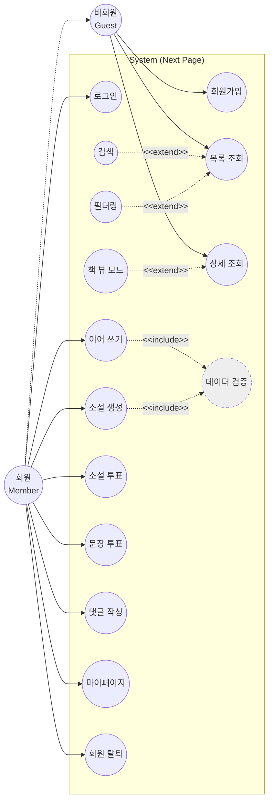
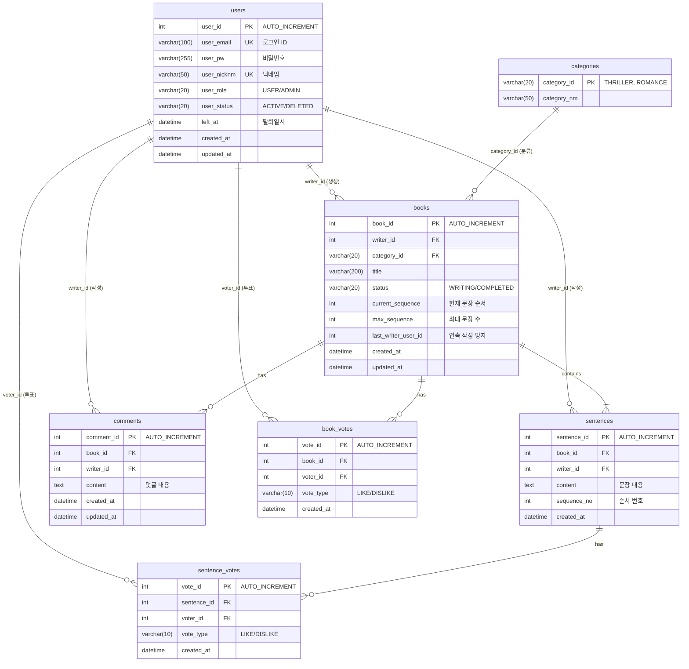

# 📚 Next Page : 우리가 함께 만드는 이야기
> **"당신의 한 문장이 베스트셀러의 시작이 됩니다."**  
> 누구나 작가가 되어 릴레이로 소설을 완성하는 집단 지성 창작 플랫폼

<br>

## 📑 목차
1. [Part 1. 프로젝트 소개](#part-1-프로젝트-소개)
   - [프로젝트 소개](#1-프로젝트-소개)
   - [팀원 및 역할 분담](#2-팀원-및-역할-분담-team-next-page)
   - [기술 스택](#3-기술-스택-tech-stack)
   - [주요 기능](#4-주요-기능-key-features)
   - [요구사항 및 유스케이스](#5-요구사항-및-유스케이스-requirements--use-case)
   - [ERD 설계](#6-erd-설계-entity-relationship)
   - [Database Schema](#7-database-schema-ddl)
   - [API 명세](#8-api-명세-endpoint-example)
   - [패키지 구조](#9-패키지-구조-package-structure)
2. [Part 2. 개발자 가이드](#part-2-개발자-가이드-developer-guidelines)
   - [코딩 컨벤션 및 패턴](#1-코딩-컨벤션-및-패턴)
   - [협업 컨벤션](#2-협업-컨벤션-collaboration)
   - [라이브러리 및 도구 활용](#3-라이브러리-및-도구-활용)

<br>

# 🚀 Part 1. 프로젝트 소개

## 1. 📝 프로젝트 소개
**Next Page**는 한 사람이 모든 이야기를 쓰는 것이 아니라, 여러 사용자가 **문장 단위로 이어 쓰며 하나의 소설을 완성**하는 릴레이 창작 서비스입니다.

단순한 게시판이 아닙니다. **순서(Sequence)와 상태(Status) 관리**가 핵심인 이 프로젝트는, 앞사람이 글을 완료해야만 뒷사람이 쓸 수 있는 **동시성 제어**와 **도메인 규칙**을 엄격하게 준수합니다.

### 📅 개발 기간
* **2025.12.23 ~ 2026.01.16**

<br>

## 2. 👥 팀원 및 역할 분담 (Team Next Page)
우리는 **도메인 주도 설계(DDD)** 원칙에 따라, 기능 단위가 아닌 **도메인(Context)** 단위로 역할을 분담하여 전문성을 높였습니다.

| 이름 | 포지션 | 담당 도메인 & 핵심 역할 |
|:---:|:---:|:---|
| **정진호** | **Team Leader** | **🏛 Core & Architecture**<br>- 프로젝트 아키텍처 설계 (CQRS 패턴 적용)<br>- `Story` 애그리거트 상태 관리 및 순서 제어 로직<br>- 전역 예외 처리 및 공통 응답 포맷 정의<br>**✍️ Writing (Command) & 📖 Reading (Query)**<br>- 문장 작성(Append) 및 유효성 검사, 이야기 완결 처리<br>- 소설 조회 및 검색 최적화, 필터링 및 페이징 처리<br>- 완성된 소설 '책 뷰' 렌더링 API |
| **김태형** | **Sub Leader** | **🔐 Member & Auth**<br>- Spring Security 기반 인증/인가 (회원가입, 로그인)<br>- **Soft Delete**를 적용한 안전한 회원 탈퇴 처리<br>- 마이페이지 (내 서재, 프로필 관리) |
| **정병진** | **Developer** | **❤️ Reaction & Support**<br>- 문장/소설 투표(LIKE/DISLIKE) 기능<br>- 소설 감상평(댓글) CRUD (문장 댓글 제외)<br>- UI/UX 인터랙션 요소 개발 지원 |

<br>

## 3. 🛠️ 기술 스택 (Tech Stack)

### 💻 개발 환경 (Development Environment)
*   **IDE:** IntelliJ IDEA
*   **JDK:** Java 17 (Amazon Corretto or Azul Zulu)
*   **Database:** MariaDB 10.6+
*   **Build Tool:** Gradle
*   **Framework:** Spring Boot 3.5.9

### Backend


### Architecture Strategy
*   **RESTful API:** 자원(Resource) 중심의 명확한 URI 설계 및 HTTP Method 활용
*   **DDD (Domain-Driven Design):** 비즈니스 로직을 Service가 아닌 **Entity(도메인 객체)에 위임**하여 응집도 강화
*   **CQRS (Command Query Responsibility Segregation):**
    *   **Command (쓰기):** 데이터 무결성이 중요한 로직 (JPA Dirty Checking 활용)
    *   **Query (읽기):** 조회 성능 최적화를 위한 별도 DTO 조회 로직 분리

<br>

## 4. ✨ 주요 기능 (Key Features)

### 🚀 1. 릴레이 소설 창작 (Core)
*   **이야기 시작:** 제목, 장르, 첫 문장을 등록하여 방을 개설합니다.
*   **이어 쓰기 (Sequence Control):**
    *   현재 순서(`current_sequence`)인 경우에만 작성 권한이 부여됩니다.
    *   **연속 작성 금지:** 바로 앞 문장을 쓴 사람은 연달아 쓸 수 없습니다. (`last_writer_id` 체크)
*   **자동 완결:** 설정된 최대 문장 수에 도달하면 이야기는 `COMPLETED` 상태로 잠깁니다.

### 📚 2. 완결 소설 서재 (Query)
*   **명예의 전당:** 완결된 소설은 별도의 '서재' 공간에 전시됩니다.
*   **뷰어 모드:** 문장 단위가 아닌, 한 권의 책을 읽는 듯한 매끄러운 뷰를 제공합니다.

### 🔐 3. 회원 서비스 (Soft Delete)
*   **안전한 탈퇴:** 회원이 탈퇴해도 작성한 문장은 사라지지 않습니다.
*   **상태 관리:** 탈퇴한 회원의 닉네임은 "탈퇴한 사용자"로 표시되어 소설의 맥락을 유지합니다.

### ❤️ 4. 소통 및 평가
*   **개추/비추:** 소설에 대해 `LIKE` 또는 `DISLIKE`로 투표할 수 있습니다. (1인 1투표 제한)
*   **감상평:** 소설에 댓글을 남겨 작가들과 소통할 수 있습니다.

<br>

<br>

## 5. 📋 요구사항 및 유스케이스 (Requirements & Use Case)

### ✅ 기능 요구사항 (Functional Requirements)

### 5.1 요구사항 분류 기준 (Requirements Classification Standards)
본 프로젝트의 요구사항은 도메인 컨텍스트와 비즈니스 주체에 따라 아래와 같이 5가지 영역으로 분류하여 체계적으로 관리합니다.

*   **FR-1xx (회원/인증):** 사용자 라이프사이클(가입, 로그인, 정보수정, 탈퇴) 및 신원 검증
*   **FR-2xx (소설 관리):** 소설 방(Book)의 생성, 조회, 검색, 정렬 등 메타데이터 관리
*   **FR-3xx (집필/릴레이):** 문장(Sentence) 작성, 순서 제어, 완결 처리 등 핵심 비즈니스 로직
*   **FR-4xx (반응/소통):** 투표, 댓글, 신고 등 사용자 간 인터랙션
*   **FR-5xx (시스템/기타):** 관리자 기능, 파일 처리, 스케줄링, 보안 정책

<br>

### 5.2 상세 기능 요구사항 (Functional Requirements)

| ID | 대분류 | 중분류 | 소분류 | 요구사항 명 | 상세 내용 및 검증 기준 (Acceptance Criteria) |
|:---:|:---:|:---:|:---:|:---:|:---|
| **FR-101** | **회원** | 계정 | 가입 | 이메일 가입 | 이메일 형식의 아이디, 비밀번호, 닉네임을 입력받아 가입한다. |
| **FR-102** | **회원** | 계정 | 검증 | 중복 확인 | 이미 가입된 이메일이나 사용 중인 닉네임은 사용할 수 없다 (비동기 확인). |
| **FR-103** | **회원** | 계정 | 검증 | 입력 유효성 | 비밀번호는 영문/숫자/특수문자 포함 8~20자, 닉네임은 특수문자 제외 2~10자로 제한. |
| **FR-104** | **회원** | 인증 | 로그인 | 일반 로그인 | 등록된 이메일/비밀번호 일치 시 JWT Access Token과 Refresh Token 발급. |
| **FR-105** | **회원** | 인증 | 상태 | 토큰 갱신 | Access Token 만료 시 Refresh Token을 통해 로그인 상태 연장 (Silent Refresh). |
| **FR-106** | **회원** | 인증 | 로그아웃 | 로그아웃 | 클라이언트 토큰 삭제 및 서버 측 Refresh Token 만료 처리 (Redis 블랙리스트 등). |
| **FR-107** | **회원** | 정보 | 수정 | 프로필 변경 | 닉네임 및 비밀번호 변경 가능. 비밀번호 변경 시 현재 비밀번호 확인 필수. |
| **FR-108** | **회원** | 정보 | 조회 | 마이페이지 | 내 작성 소설, 내 작성 문장, 내가 받은 좋아요 수 등 활동 지표 대시보드 제공. |
| **FR-109** | **회원** | 탈퇴 | 처리 | 계정 정지 | 탈퇴 요청 시 즉시 삭제가 아닌 `DELETED` 상태로 변경(Soft Delete). 30일 후 데이터 파기 고려. |
| **FR-201** | **소설** | 생성 | 설정 | 소설 방 생성 | 제목(50자), 카테고리, 최대 문장 수(10~100)를 설정하여 방 개설. |
| **FR-202** | **소설** | 생성 | 검증 | 생성 제한 | 도배 방지를 위해 동일 사용자는 1분 내 연속 생성 불가. |
| **FR-203** | **소설** | 조회 | 목록 | 페이징 처리 | 소설 목록은 10개/20개 단위 페이징 또는 무한 스크롤로 조회. |
| **FR-204** | **소설** | 조회 | 정렬 | 다중 정렬 | 최신순, 좋아요순, 조회수순 정렬 옵션 제공. |
| **FR-205** | **소설** | 조회 | 필터 | 카테고리 필터 | 전체/로맨스/스릴러/판타지 등 장르별 필터링 기능. |
| **FR-206** | **소설** | 조회 | 검색 | 키워드 검색 | 제목 및 닉네임에 포함된 키워드로 검색 (LIKE 검색 또는 Full-text Search). |
| **FR-207** | **소설** | 조회 | 상세 | 메타 정보 | 상세 페이지 상단에 제목, 장르, 현재 진행률(현 문장수/최대 문장수), 참여 작가 수 표시. |
| **FR-208** | **소설** | 조회 | 뷰어 | 리더 모드 | 완결(`COMPLETED`)된 소설은 책 넘김 애니메이션이 적용된 '읽기 전용 뷰' 제공. |
| **FR-301** | **집필** | 작성 | 권한 | 순서 검증 | 현재 진행 중인 순서(`current_sequence`)가 아니면 작성 불가 요청 차단. |
| **FR-302** | **집필** | 작성 | 권한 | 중복 방지 | `last_writer_id`와 현재 작성자 `user_id`가 같으면 연속 작성 불가 (단, 1인 소설 모드 제외). |
| **FR-303** | **집필** | 데이터 | 저장 | 문장 등록 | 10~200자 이내의 내러티브 저장. 저장 시 `sequence_no` 자동 채번 및 소설 `updated_at` 갱신. |
| **FR-304** | **집필** | 로직 | 상태 | 자동 완결 | 등록된 문장이 설정된 `max_sequence`에 도달하면 소설 상태를 `COMPLETED`로 변경. |
| **FR-305** | **집필** | 수정 | 규칙 | 과거 수정 제한 | 이미 다음 문장이 이어진 경우, 맥락 보존을 위해 이전 문장은 수정/삭제 절대 불가. |
| **FR-306** | **집필** | 수정 | 허용 | 최근 문장 수정 | 다음 문장이 없는(가장 최신) 문장에 한해 작성자 본인은 수정/삭제 가능. |
| **FR-307** | **집필** | 삭제 | 연쇄 | 문장 삭제 | 마지막 문장 삭제 시 `current_sequence`를 1 감소시키고 `last_writer_id`를 이전 작성자로 롤백. |
| **FR-308** | **집필** | 관리 | 신고 | 문장 신고 | 욕설/비하 등 부적절한 문장 신고 기능. 누적 신고 수 초과 시 블라인드 처리. |
| **FR-401** | **반응** | 투표 | 소설 | 북마크/좋아요 | 소설 자체에 대한 '좋아요' 및 '관심 등록'. 마이페이지에서 모아보기 가능. |
| **FR-402** | **반응** | 투표 | 문장 | 문장 좋아요 | 특정 문장이 인상 깊을 때 '좋아요' 클릭. 문장별 득표수 집계. |
| **FR-403** | **반응** | 댓글 | 작성 | 감상평 등록 | 소설 상세 페이지 하단에 감상평(댓글) 등록. (글자수 500자 제한). |
| **FR-404** | **반응** | 댓글 | 관리 | 댓글 권한 | 본인 댓글 수정/삭제 가능. 타인 댓글 삭제 불가. |
| **FR-501** | **시스템** | 보안 | 인증 | API 보호 | Public API(조회)를 제외한 모든 CUD/Private API는 JWT 유효성 검증 필터 적용. |
| **FR-502** | **시스템** | 보안 | 입력 | XSS 방어 | 사용자가 입력하는 문장 및 댓글에 스크립트 태그 포함 시 Escape 처리. |
| **FR-503** | **시스템** | 운영 | 오류 | 글로벌 예외 | 400/401/403/404/500 에러 발생 시 규격화된 JSON 포맷 (`code`, `message`)으로 응답. |
| **FR-504** | **시스템** | 데이터 | 무결성 | 트랜잭션 | 문장 등록과 소설 상태 변경은 하나의 트랜잭션으로 묶여야 함 (Atomic). |

<br>

### ✅ 비기능 요구사항 (Non-Functional Requirements)

| ID | 분류 | 요구사항 명 | 상세 내용 및 기준 |
|:---:|:---:|:---:|:---|
| **NFR-101** | 보안 | 인증/인가 | 작성/투표/마이페이지 등 CUD 작업 시 반드시 세션/토큰 검증 수행 (비회원 403). |
| **NFR-102** | 보안 | 권한 제어 | 본인 확인이 필요한 기능(수정/삭제)은 서버 단에서 `writer_id`와 세션 `user_id` 일치 여부 검사 필수. |
| **NFR-103** | 보안 | 입력 검증 | XSS 방지를 위해 문장/댓글 입력 시 HTML 태그 이스케이프 또는 허용 목록(Sanitizer) 처리. |
| **NFR-201** | UX | 반응성 | 연속적인 문장 읽기 경험을 위해 스크롤 페이징(Infinite Scroll) 또는 최적화된 페이지네이션 적용. |
| **NFR-202** | UX | 실시간성 | 소설 완결 시 또는 문장 업데이트 시 지연 없이 상태 반영 (캐시 무효화 전략). |
| **NFR-203** | UX | 로딩 처리 | 데이터 로딩이 500ms(0.5초) 이상 소요될 경우, 사용자가 인지할 수 있도록 로딩 스피너(Loading Spinner) 또는 스켈레톤 UI를 표시. |
| **NFR-301** | 성능 | 동시성 제어 | 동일 소설, 동일 시퀀스에 대한 다중 쓰기 요청 시 1건만 성공하고 나머지는 우아하게 실패(Locking) 처리. |
| **NFR-302** | 성능 | 조회 최적화 | 메인 페이지 소설 목록 조회(쿼리 복잡도 높음)는 조회 전용 모델(읽기 DB) 또는 캐싱 활용 고려. |


<br>

### 👤 유스케이스 다이어그램 (Use Case Diagram)



<br>

## 6. 🗂️ ERD 설계 (Entity Relationship)
`users`의 Soft Delete 상태값과 역할별로 명확히 구분된 FK(`writer_id`, `voter_id`) 구조입니다.



<br>

## 7. 💾 Database Schema (DDL)

프로젝트 초기 설정을 위한 MariaDB DDL 스크립트입니다.

<details>
<summary>👉 <b>Click to view SQL Script</b></summary>

```sql
-- 1. 사용자 (Users)
CREATE TABLE `users` (
    `user_id`      INT          NOT NULL AUTO_INCREMENT,
    `user_email`   VARCHAR(100) NOT NULL COMMENT '로그인 ID',
    `user_pw`      VARCHAR(255) NOT NULL,
    `user_nicknm`  VARCHAR(50)  NOT NULL,
    `user_role`    VARCHAR(20)  NOT NULL DEFAULT 'USER',
    `user_status`  VARCHAR(20)  NOT NULL DEFAULT 'ACTIVE' COMMENT 'ACTIVE, DELETED',
    `left_at`      DATETIME     NULL COMMENT '탈퇴일시',
    `created_at`   DATETIME     NOT NULL DEFAULT NOW(),
    `updated_at`   DATETIME     NULL,
    PRIMARY KEY (`user_id`),
    UNIQUE KEY `uk_users_email` (`user_email`),
    UNIQUE KEY `uk_users_nicknm` (`user_nicknm`)
);

-- 2. 카테고리 (Categories)
CREATE TABLE `categories` (
    `category_id` VARCHAR(20) NOT NULL COMMENT 'PK: THRILLER, ROMANCE',
    `category_nm` VARCHAR(50) NOT NULL,
    PRIMARY KEY (`category_id`)
);

-- 3. 소설 (Books)
CREATE TABLE `books` (
    `book_id`             INT          NOT NULL AUTO_INCREMENT,
    `writer_id`           INT          NOT NULL,
    `category_id`         VARCHAR(20)  NOT NULL,
    `title`               VARCHAR(200) NOT NULL,
    `status`              VARCHAR(20)  NOT NULL DEFAULT 'WRITING',
    `current_sequence`    INT          NOT NULL DEFAULT 1,
    `max_sequence`        INT          NOT NULL DEFAULT 20,
    `last_writer_user_id` INT          NULL COMMENT '연속 작성 방지',
    `created_at`          DATETIME     NOT NULL DEFAULT NOW(),
    `updated_at`          DATETIME     NULL,
    PRIMARY KEY (`book_id`)
);

-- 4. 문장 (Sentences)
CREATE TABLE `sentences` (
    `sentence_id` INT      NOT NULL AUTO_INCREMENT,
    `book_id`     INT      NOT NULL,
    `writer_id`   INT      NOT NULL,
    `content`     TEXT     NOT NULL,
    `sequence_no` INT      NOT NULL,
    `created_at`  DATETIME NOT NULL DEFAULT NOW(),
    PRIMARY KEY (`sentence_id`)
);

-- 5. 댓글 (Comments)
CREATE TABLE `comments` (
    `comment_id` INT      NOT NULL AUTO_INCREMENT,
    `book_id`    INT      NOT NULL,
    `writer_id`  INT      NOT NULL,
    `content`    TEXT     NOT NULL,
    `created_at` DATETIME NOT NULL DEFAULT NOW(),
    `updated_at` DATETIME NULL,
    PRIMARY KEY (`comment_id`)
);

-- 6. 소설 투표 (Book Votes)
CREATE TABLE `book_votes` (
    `vote_id`    INT         NOT NULL AUTO_INCREMENT,
    `book_id`    INT         NOT NULL,
    `voter_id`   INT         NOT NULL,
    `vote_type`  VARCHAR(10) NOT NULL COMMENT 'LIKE, DISLIKE',
    `created_at` DATETIME    NOT NULL DEFAULT NOW(),
    PRIMARY KEY (`vote_id`),
    UNIQUE KEY `uk_book_voter` (`book_id`, `voter_id`),
    CONSTRAINT `chk_book_vote_type` CHECK (`vote_type` IN ('LIKE', 'DISLIKE'))
);

-- 7. 문장 투표 (Sentence Votes)
CREATE TABLE `sentence_votes` (
    `vote_id`     INT         NOT NULL AUTO_INCREMENT,
    `sentence_id` INT         NOT NULL,
    `voter_id`    INT         NOT NULL,
    `vote_type`   VARCHAR(10) NOT NULL COMMENT 'LIKE, DISLIKE',
    `created_at`  DATETIME    NOT NULL DEFAULT NOW(),
    PRIMARY KEY (`vote_id`),
    UNIQUE KEY `uk_sentence_voter` (`sentence_id`, `voter_id`),
    CONSTRAINT `chk_sentence_vote_type` CHECK (`vote_type` IN ('LIKE', 'DISLIKE'))
);
```
</details>

<br>

## 8. 🔌 API 명세 (Endpoint Example)

| Method | URI | 설명 | 권한 |
|:---:|:---|:---|:---:|
| POST | `/api/auth/signup` | 신규 작가 등록 (회원가입) | All |
| POST | `/api/auth/login` | 로그인 | All |
| POST | `/api/auth/logout` | 로그아웃 | User |
| POST | `/api/books` | 새로운 이야기 시작 (방 만들기) | User |
| GET | `/api/books` | 이야기 목록 조회 (필터링, 검색, 페이징) | All |
| GET | `/api/books/{bookId}` | 소설 상세 조회 (문장 전체 리스트) | All |
| POST | `/api/books/{bookId}/sentences` | 문장 이어 쓰기 (핵심 기능) | User |
| GET | `/api/books/{bookId}/view` | 완결 소설 책 뷰어 모드 조회 | All |
| POST | `/api/books/{bookId}/votes` | 소설 개추/비추 (LIKE/DISLIKE) | User |

<br>

<br>

## 9. 📦 패키지 구조 (Package Structure)
`com.team2.nextpage` 패키지 하위에 **Command(JPA)** 와 **Query(MyBatis)**, 그리고 **Common** 영역으로 나누어 설계했습니다. 요청/응답(DTO)과 계층별 의존성을 명확히 분리합니다.

```text
src/main/java/com/team2/nextpage
├── 📂 common                  // 공통 모듈 (정진호)
│   ├── 📂 entity              // BaseEntity 등
│   ├── 📂 error               // ErrorCode, Exception 클래스
│   ├── 📂 exception           // GlobalExceptionHandler
│   └── 📂 response            // ApiResponse
├── 📂 config                  // 설정 (정진호)
│   ├── SecurityConfig
│   └── ModelMapperConfig
├── 📂 command                 // [CUD] JPA 영역
│   ├── 📂 member              // 회원 (김태형)
│   │   ├── 📂 controller
│   │   ├── 📂 service
│   │   ├── 📂 repository
│   │   ├── 📂 entity          // DB Tables (Domain)
│   │   └── 📂 dto             // Request DTO
│   ├── 📂 book                // 소설 (정진호)
│   │   ├── 📂 controller
│   │   ├── 📂 service
│   │   ├── 📂 repository
│   │   ├── 📂 entity
│   │   └── 📂 dto
│   └── 📂 reaction            // 반응 (정병진)
│       ├── 📂 controller
│       ├── 📂 service
│       ├── 📂 repository
│       ├── 📂 entity
│       └── 📂 dto
└── 📂 query                   // [R] MyBatis 영역
    ├── 📂 member              // 회원 조회 (김태형)
    │   ├── 📂 controller
    │   ├── 📂 service
    │   ├── 📂 mapper          // MyBatis Interface
    │   └── 📂 dto             // Response DTO
    ├── 📂 book                // 소설 조회 (정진호)
    └── 📂 reaction            // 반응 조회 (정병진)
```

<br>

<br>

# 🛠️ Part 2. 개발자 가이드 (Developer Guidelines)
> **"우리는 하나의 원칙 아래 코드를 작성합니다."**
이 섹션은 Next Page 프로젝트에 참여하는 모든 개발자(및 AI 어시스턴트)가 준수해야 할 핵심 컨벤션과 가이드라인입니다.

## 1. 🏛️ 코딩 컨벤션 및 패턴

### 1.1 Entity & Domain Logic (DDD)
*   **Setter 사용 금지:** Entity에는 `@Setter`를 절대 사용하지 않는다. 상태 변경은 명확한 의도를 가진 메서드(Business Method)로 구현한다.
    *   *Bad:* `book.setStatus("COMPLETED");`
    *   *Good:* `book.completeStory();`
*   **생성자:** `@NoArgsConstructor(access = AccessLevel.PROTECTED)`를 기본으로 사용하며, 필요한 필드만 받는 `@Builder`를 별도로 구현한다.
*   **도메인 로직 위치:** 비즈니스 규칙은 Service가 아닌 **Entity 내부**에 위치시킨다.
    *   Ex) '다음 순서인지 확인', '소설 완결 조건 체크' 등은 Entity 메서드로 구현.

### 1.2 Layered Architecture Rules
*   **Controller:** 요청값 검증(`@Valid`), 응답 변환(Representation)만 담당. 로직 포함 금지.
*   **Service:** 트랜잭션 관리(`@Transactional`) 및 도메인 객체 간의 협력 조율(Orchestration).
    *   순수 비즈니스 로직은 Entity에 위임하고, Service는 그것을 호출하는 형태.
*   **DTO:**
    *   Entity를 직접 반환하지 않는다 (**Strict Rule**).
    *   Request/Response DTO는 `record` 또는 `static class`로 정의하여 불변성을 유지 권장.
    *   JPA Entity <-> DTO 변환은 `ModelMapper`나 생성자/Builder 패턴 사용.

### 1.3 CQRS 구현 규칙
*   **Command (쓰기):**
    *   Repository: `JpaRepository` 상속.
    *   복잡한 연관관계 매핑 및 생명주기가 같은 애그리거트는 JPA Cascade 활용.
*   **Query (읽기):**
    *   Mapper: `MyBatis` Mapper Interface 사용 (`@Mapper`).
    *   XML 위치: `resources/mapper/**/*.xml`.
    *   쿼리 결과는 Entity가 아닌 **조회 전용 DTO**로 즉시 매핑.

### 1.4 공통 필드 및 응답
*   **BaseEntity:** `created_at`, `updated_at` 등 공통 감사(Audit) 필드는 `@MappedSuperclass`로 관리.
*   **API Response:** 성공/실패 여부를 포함한 공통 래퍼(Wrapper) 클래스 사용 (프로젝트 내 정의된 포맷 준수).

### 1.5 Security & JWT
*   **Authentication:** `Bearer` Token 방식 사용. Header의 `Authorization` 필드 파싱.

<br>


## 2. 🤝 협업 컨벤션 (Collaboration)

### 🌳 Branch Strategy
*   `main`: 배포 가능한 안정 버전
*   `develop`: 개발 중인 최신 버전
*   `feature/{domain}/{function}`: 기능 단위 개발 브랜치
    *   Ex) `feature/member/login`, `feature/book/create`

<br>

## 3. 🛠️ 라이브러리 및 도구 활용
*   **Lombok:** `@Getter`, `@RequiredArgsConstructor`, `@Slf4j` 적극 활용. `@ToString`은 순환 참조 주의(exclude 설정).
*   **Validation:** `jakarta.validation` 어노테이션(`@NotNull`, `@Size`, `@Email`)으로 입력값 검증 수행.
*   **Data Type:** 상태값 등은 String 대신 **Enum 사용 권장** (`@Enumerated(EnumType.STRING)`).
*   **Soft Delete:** `@SQLDelete` 및 `@SQLRestriction` 어노테이션을 사용하여 자동화. (Java 코드는 `delete()` 호출하지만 DB는 `UPDATE` 실행).

---
Copyright © 2026 **Team Next Page**. All rights reserved.
