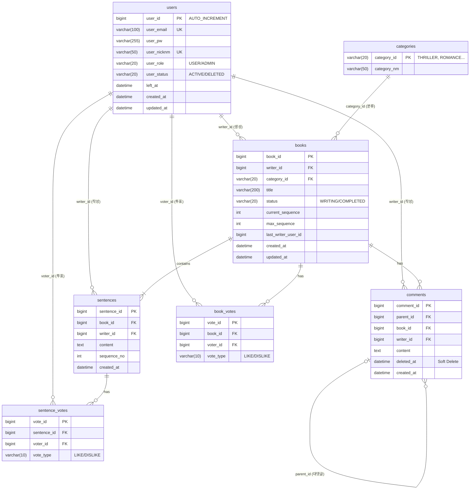

<div align="center"></div>

# 📚 Next Page : 우리가 함께 만드는 실시간 릴레이 소설
>
> **"당신의 한 문장이 베스트셀러의 시작이 됩니다."**
> 누구나 작가가 되어 실시간으로 소설을 완성하는 집단 지성 창작 플랫폼

**문서 구조:**

- **PART 1: 공통 (Common)** - 프로젝트 개요, 팀 구성, 기술 스택, 기능 명세
- **PART 2: AS-IS (Monolithic)** - 초기 단일 애플리케이션 아키텍처 (2025.12.23 ~ 2026.01.10)
- **PART 3: TO-BE (MSA)** - Microservices Architecture (2026.01.11 ~ 현재) ✅ 현재 운영

<br>

## 📑 목차

### PART 1: 공통 (Common)

1. [프로젝트 소개](#part-1-1-프로젝트-소개)
2. [팀원 및 역할 분담](#part-1-2-팀원-및-역할-분담)
3. [기술 스택](#part-1-3-기술-스택)
4. [주요 기능](#part-1-4-주요-기능)
5. [요구사항](#part-1-5-요구사항)
6. [ERD 설계](#part-1-6-erd-설계)
7. [Database Schema](#part-1-7-database-schema)

### PART 2: AS-IS (Monolithic)

1. [Monolithic 아키텍처](#part-2-1-monolithic-아키텍처)
2. [Monolithic 실행 방법](#part-2-2-monolithic-실행-방법)
3. [Monolithic 패키지 구조](#part-2-3-monolithic-패키지-구조)

### PART 3: TO-BE (MSA) ✅

1. [MSA 아키텍처](#part-3-1-msa-아키텍처)
2. [MSA 시스템 구성도](#part-3-2-msa-시스템-구성도)
3. [MSA 전환 핵심 포인트](#part-3-3-msa-전환-핵심-포인트)
4. [MSA 실행 방법](#part-3-4-msa-실행-방법)
5. [API 명세](#part-3-5-api-명세)

<br>

---

# PART 1: 공통 (Common)

프로젝트 전반에 대한 개요, 팀 구성, 기술 스택, 기능 요구사항을 다룹니다.

---

## PART 1-1. 프로젝트 소개

**Next Page**는 한 사람이 모든 이야기를 쓰는 것이 아니라, 여러 사용자가 **문장 단위로 이어 쓰며 하나의 소설을 완성**하는 릴레이 창작 서비스입니다.

단순한 게시판이 아닙니다. **WebSocket을 활용한 실시간 타이핑 표시**, **순서(Sequence) 제어**, **투표 기반 평가**가 결합된 몰입형 창작 플랫폼입니다. 앞사람이 글을 완료해야만 뒷사람이 쓸 수 있는 **동시성 제어**와 **도메인 규칙**을 엄격하게 준수합니다.

### 📅 개발 기간

- **2025.12.23 ~ 2026.01.16** (총 4주)

### 🏗️ 아키텍처 변천

- **Phase 1 - Monolithic (2025.12.23 ~ 2026.01.10):** 단일 Spring Boot 애플리케이션

- **Phase 2 - MSA (2026.01.11 ~ 현재):** Microservices Architecture로 전환 완료 ✅

### 📊 프로젝트 진행 현황

| 기능 영역 | 상태 | 완료 항목 |
|:---:|:---:|:---|
| **⚡ 실시간/웹소켓** | ✅ 완료 | **실시간 타이핑/편집 잠금**, **댓글/문장 실시간 푸시**, STOMP 프로토콜 최적화 |
| **🔐 인증/인가** | ✅ 완료 | JWT, Refresh Token, 강제 로그인 모달, **Soft Delete(User)** |
| **👤 회원 관리** | ✅ 완료 | 회원가입/탈퇴, **실시간 입력값 검증**, 마이페이지 대시보드 |
| **📖 소설 집필** | ✅ 완료 | **문장 이어쓰기(순서 제어)**, **마지막 문장만 수정/삭제(Restriction)**, **편집 중 잠금(Lock)** |
| **📚 소설 조회** | ✅ 완료 | 무한 스크롤, 페이징/정렬, **책 넘김 효과 뷰어**, **내가 쓴 글/댓글 모아보기** |
| **❤️ 반응/평가** | ✅ 완료 | **실시간 댓글(WebSocket)**, 계층형 대댓글, 개추/비추 투표, Soft Delete(Comment) |
| **🏗️ MSA 전환** | ✅ 완료 | **Eureka**, **Gateway + JWT Filter**, **Feign Client**, 3개 DB 분리, **Application Level Join** |
| **🛡️ 안정성** | ✅ 완료 | **Resilience4j (Circuit Breaker)** 적용, 장애 전파 방지 및 Fallback 처리 |
| **API & Architecture** | ✅ 완료 | **HATEOAS**, CQRS, Swagger, **Dynamic Topic Routing (/topic/{bookId})** |
| **🎨 UI/UX** | ✅ 완료 | **Cute Pop 디자인**, 로고 폰트(Gaegu), 모달 UX 개선, 토스트 알림 |
| **🧪 테스트** | ✅ 완료 | 전체 API 시나리오 테스트 (`http/api-test.http`), 단위/통합 테스트 환경 |

<br>

---

## PART 1-2. 팀원 및 역할 분담

우리는 **도메인 주도 설계(DDD)** 원칙에 따라, 기능 단위가 아닌 **도메인(Context)** 단위로 역할을 분담하여 전문성을 높였습니다.

| 이름 | 포지션 | 담당 도메인 & 핵심 역할 |
|:---:|:---:|:---|
| **정진호** | **Team Leader** | **🏛 Core & Architecture**<br>- 프로젝트 아키텍처 설계 (CQRS, WebSocket, MSA 전환)<br>- 실시간 타이핑 및 알림 시스템 구현<br>- `Story` 애그리거트 상태/순서 제어 로직<br>**✍️ Writing & Query**<br>- 문장 작성(Append) 및 유효성 검사<br>- 동적 쿼리(MyBatis) 기반 조회/검색 최적화 |
| **김태형** | **Sub Leader** | **🔐 Member & Auth**<br>- Spring Security + JWT 인증/인가 시스템<br>- **Soft Delete**를 적용한 안전한 회원 탈퇴/관리<br>- 실시간 유효성 검증 로직 및 마이페이지<br>- MSA: member-service 구축 및 Internal API 제공 |
| **정병진** | **Developer** | **❤️ Reaction & Support**<br>- **개추/비추(Thumb Up/Down)** 투표 시스템<br>- 계층형 댓글(대댓글) 구조 설계 및 구현<br>- 관리자 권한(댓글/유저 관리) 기능 구현<br>- MSA: reaction-service 구축 및 양방향 Feign 통합 |
| **최현지** | **Document Manager** | **📄 Documentation & QA**<br>- 프로젝트 문서화 및 리드미(README) 관리<br>- API 명세 및 개발자 가이드 최신화<br>- 전체 기능 QA 및 시나리오 점검 |

<br>

---

## PART 1-3. 기술 스택

### 💻 개발 환경

- **IDE:** IntelliJ IDEA

- **JDK:** Java 17 (Amazon Corretto or Azul Zulu)
- **Database:** MariaDB 10.6+
- **Build Tool:** Gradle
- **Framework:** Spring Boot 3.5.9

### Backend & Real-time


### Frontend


### Architecture Strategy (공통 패턴)

- **RESTful API:** 자원(Resource) 중심의 명확한 URI 설계 및 HTTP Method 활용

- **CQRS Pattern:**
  - **Command (쓰기):** JPA (Domain Logic, Dirty Checking) - 데이터 무결성 보장
  - **Query (읽기):** MyBatis (Dynamic Query) - 복잡한 통계/조회 성능 최적화
- **Event-Driven:** WebSocket을 통한 실시간 상태 동기화 (작성 중, 댓글 작성 등)

<br>

---

## PART 1-4. 주요 기능

### ⚡ 1. 실시간 인터랙션

- **타이핑 인디케이터:** 누가 지금 다음 문장을 쓰고 있는지, 댓글을 달고 있는지 실시간으로 보여줍니다.

- **라이브 업데이트:** 새로 고침 없이도 새로운 소설, 이어진 문장, 달린 댓글이 화면에 즉시 나타납니다.
- **무한 스크롤:** 소설 목록을 매끄럽게 탐색할 수 있도록 무한 스크롤을 지원합니다.
- **Pull-to-Refresh:** 모바일 환경에서 화면을 당겨서 손쉽게 새로고침할 수 있습니다.

### 🚀 2. 릴레이 소설 창작 (Core)

- **이야기 시작:** 제목, 장르(로맨스/스릴러 등), 첫 문장을 등록하여 방을 개설합니다.

- **순서 및 수정 제어:**
  - **순차적 작성:** 현재 순서(`current_sequence`)인 경우에만 작성 권한이 부여됩니다.
  - **편집 잠금:** 누군가 문장을 수정 중이면 실시간으로 "수정 중..." 상태가 공유되며 타인의 입력을 막습니다.
  - **수정/삭제 제한:** 오직 **마지막 문장**만 수정하거나 삭제할 수 있어, 이전 이야기의 흐름을 훼손할 수 없습니다.
- **완결 제어:**
  - **자동 완결:** 설정된 최대 문장 수에 도달하면 이야기는 `COMPLETED` 상태로 잠깁니다.
  - **수동 완결:** 소설 생성자(방장)는 이야기가 만족스럽게 끝났다면 언제든 수동으로 소설을 완결 지을 수 있습니다.

### ❤️ 3. 평가 및 소통

- **개추/비추:** 단순 좋아요가 아닌, 문장과 소설에 대해 명확한 호불호를 표현할 수 있습니다.

- **계층형 댓글:** 소설에 대해 깊이 있는 토론을 할 수 있도록 대댓글 기능을 제공합니다.

### 🔐 4. 회원 서비스

- **안전한 탈퇴:** 회원이 탈퇴해도 작성한 문장은 사라지지 않습니다 (Soft Delete).

- **통합 서재 관리:** 내가 만든 소설, 내가 쓴 문장, 내가 쓴 댓글을 탭별로 구분하여 모아볼 수 있습니다.
- **강제 로그인 유도:** 비회원도 구경은 가능하지만, 참여하려고 하면 자연스럽게 로그인 모달이 뜹니다.
- **자동 로그인:** Refresh Token을 활용해 매번 로그인할 필요 없이 앱처럼 바로 이용 가능합니다.

### 🎨 5. 사용자 경험

- **감성 디자인:** 파스텔톤 컬러(#FF8BA7, #845EF7)와 둥근 모서리, 통통 튀는 애니메이션.

- **책 뷰어 모드:** 완결된 소설은 실제 전자책처럼 편하게 읽을 수 있는 전용 뷰어를 제공합니다.
- **스마트 검증:** 가입 시 닉네임/이메일 중복을 키보드를 떼자마자 알려줍니다.

### 📄 6. 문서화 및 표준

- **Swagger API Docs:** `/swagger-ui/index.html` 접속 시 자동으로 생성된 최신 API 명세를 확인하고 즉시 테스트할 수 있습니다.

- **HATEOAS 적용:** 응답 데이터에 관련된 행위(`link`) 정보를 포함하여 클라이언트가 동적으로 기능을 탐색할 수 있습니다.

<br>

---

## PART 1-5. 요구사항 정의서

### 📋 기능 요구사항 (Functional Requirements)

| 클래스 | ID | 대분류 | 요구사항 명 | 상세 내용 | 비고 |
|:---:|:---:|:---:|:---:|:---|:---|
| **Member** | **FR-101** | 회원 | 회원가입 | 이메일, 비밀번호, 닉네임 입력 및 유효성 검사 (이메일 형식, 비밀번호 복잡도) | 실시간 중복체크 |
| **Member** | **FR-102** | 회원 | 로그인 | 이메일/비밀번호 기반 인증 및 JWT Access Token 발급 | 유효기간 1시간 |
| **Member** | **FR-103** | 회원 | 자동 로그인 | Refresh Token(Cookie)을 이용한 Access Token 재발급 (Silent Refresh) | 유효기간 7일 |
| **Member** | **FR-104** | 회원 | 로그아웃 | Refresh Token 무효화 및 쿠키 삭제 처리 | - |
| **Member** | **FR-105** | 회원 | 회원 탈퇴 | DB 데이터 삭제 대신 상태값 변경 (Soft Delete)으로 이력 보존 | 재가입 제한 등 가능 |
| **Member** | **FR-106** | 회원 | 마이페이지 | 내 정보(닉네임, 이메일) 및 활동 요약(작성 수, 받은 좋아요 등) 조회 | - |
| **Member** | **FR-107** | 회원 | 내 활동 조회 | 내가 쓴 소설, 내가 쓴 문장, 내가 쓴 댓글 탭 분리 페이징 조회 | - |
| **Story** | **FR-201** | 소설 | 소설 생성 | 제목, 카테고리(장르), 최대 문장 수 설정을 통한 방 개설 | - |
| **Story** | **FR-202** | 소설 | 소설 목록 조회 | 최신순/인기순 정렬, 카테고리 필터링, 검색어(제목/내용) 기반 조회 | 무한 스크롤 적용 |
| **Story** | **FR-203** | 소설 | 소설 상세 조회 | 소설 기본 정보, 참여 작가 목록, 현재 진행 상태 조회 | - |
| **Story** | **FR-204** | 소설 | 문장 이어쓰기 | 현재 순서(Sequence)에 맞춰 새로운 문장 등록 (이전 작성자 작성 불가) | 길이 제한 검증 |
| **Story** | **FR-205** | 소설 | 문장 수정 | 자신이 작성한 **마지막 문장**에 한해 내용 수정 가능 | 중간 문장 수정 불가 |
| **Story** | **FR-206** | 소설 | 문장 삭제 | 자신이 작성한 **마지막 문장**에 한해 삭제 가능 (순서 롤백) | - |
| **Story** | **FR-207** | 소설 | 소설 정보 수정 | 소설 제목 등 메타데이터 수정 (방장 권한) | - |
| **Story** | **FR-208** | 소설 | 소설 삭제 | 소설 전체 삭제 (방장 권한) - 관련된 문장/댓글 일괄 삭제(Soft) | - |
| **Story** | **FR-209** | 소설 | 뷰어 모드 | 완결된 소설의 전체 문장을 책 넘김 효과(flip) 또는 스크롤로 열람 | - |
| **Story** | **FR-210** | 소설 | 수동 완결 | 최대 문장 수 도달 전, 방장이 임의로 소설 완결 처리 가능 | - |
| **Story** | **FR-211** | 소설 | 자동 완결 | 설정된 최대 문장 수 도달 시 자동으로 상태 변경 (COMPLETED) | - |
| **Reaction** | **FR-301** | 반응 | 댓글 작성 | 특정 소설에 대한 의견(댓글) 등록 | - |
| **Reaction** | **FR-302** | 반응 | 대댓글 작성 | 특정 댓글에 대한 답글(Reply) 등록 (계층형 구조) | - |
| **Reaction** | **FR-303** | 반응 | 댓글 수정/삭제 | 본인이 작성한 댓글 내용 수정 및 삭제 (Soft Delete) | - |
| **Reaction** | **FR-304** | 반응 | 소설 투표 | 소설 전체에 대한 개추(Like) / 비추(Dislike) 투표 (토글 방식) | 1인 1투표 |
| **Reaction** | **FR-305** | 반응 | 문장 투표 | 특정 문장에 대한 개추/비추 투표 (베스트 문장 선정 활용) | - |
| **Realtime** | **FR-401** | 실시간 | 타이핑 알림 | 특정 유저가 문장을 작성 중일 때 실시간으로 "OOO님이 작성 중..." 표시 | WebSocket |
| **Realtime** | **FR-402** | 실시간 | 댓글 알림 | 특정 유저가 댓글을 작성 중일 때 실시간 타이핑 인디케이터 표시 | WebSocket |
| **Realtime** | **FR-403** | 실시간 | 라이브 업데이트 | 다른 유저가 문장/댓글 등록 시 새로고침 없이 화면에 즉시 반영 | WebSocket |
| **Admin** | **FR-901** | 관리자 | 유저 관리 | 악성 유저 강제 탈퇴 및 정지 처리 | - |
| **Admin** | **FR-902** | 관리자 | 콘텐츠 관리 | 부적절한 소설/문장/댓글 강제 블라인드 또는 삭제 처리 | - |

### 🛡️ 비기능 요구사항 (Non-Functional Requirements)

| ID | 분류 | 요구사항 명 | 상세 내용 |
|:---:|:---:|:---:|:---|
| **NFR-101** | **Security** | 비밀번호 암호화 | 사용자의 비밀번호는 BCrypt 등 단방향 해시 함수로 암호화하여 저장해야 한다. |
| **NFR-102** | **Security** | 인증 보안 | 모든 API 요청은 Stateless한 JWT로 인증하며, Refresh Token은 HttpOnly Cookie로 관리한다. |
| **NFR-103** | **Security** | 접근 제어 | 작성자 본인만 수정/삭제 가능하도록 ID 기반의 권한 검증 로직(Guard)을 포함해야 한다. |
| **NFR-201** | **Performance** | DB 최적화 | 복잡한 조회(목록, 통계)는 MyBatis Dynamic SQL을 사용하고, 쓰기는 JPA를 사용하여 성능과 정합성을 모두 잡는다. |
| **NFR-202** | **Performance** | N+1 방지 | JPA 연관관계 조회 시 Fetch Join 또는 Batch Size를 적용하거나, MSA 환경에선 Batch API를 사용한다. |
| **NFR-301** | **Architecture** | 서비스 독립성 | MSA 환경에서 한 서비스(예: Reaction)가 다운되어도 핵심 서비스(Story)는 정상 동작해야 한다. |
| **NFR-302** | **Architecture** | 데이터 분리 | 각 마이크로서비스는 고유의 데이터베이스 스키마를 가지며, 타 서비스 DB에 직접 접근하지 않는다. |
| **NFR-303** | **Architecture** | API Gateway | 모든 클라이언트 요청은 단일 진입점(Gateway)을 거치며, 여기서 인증/인가 및 라우팅을 수행한다. |
| **NFR-401** | **UX/UI** | 반응형 웹 | PC, 태블릿, 모바일 등 다양한 해상도에서 깨짐 없이 UI가 제공되어야 한다. |
| **NFR-402** | **UX/UI** | 피드백 제공 | 사용자의 모든 액션(성공, 실패, 로딩)에 대해 즉각적인 시각적 피드백(Toast, Spinner)을 제공해야 한다. |
| **NFR-501** | **Standard** | API 명세 | 모든 API는 Swagger(OpenAPI 3.0)를 통해 문서화되고 테스트 가능해야 한다. |
| **NFR-502** | **Standard** | 코드 품질 | Checkstyle 및 Google Java Style Guide를 준수하여 일관된 코드 스타일을 유지한다. |

<br>

---

## PART 1-6. ERD 설계

### 도메인 엔티티 관계

`users`의 Soft Delete 상태값과 역할별로 명확히 구분된 FK(`writer_id`, `voter_id`) 구조입니다.



<br>

---

## PART 1-7. Database Schema

### 🔄 AS-IS vs TO-BE: 데이터 타입 변경

> **확장성을 고려한 설계 개선** — MSA 전환 시 모든 ID 컬럼을 `INT` → `BIGINT`로 변경

| 컬럼명 | AS-IS (Monolithic) | TO-BE (MSA) | 변경 사유 |
|:---|:---:|:---:|:---|
| `user_id` | `INT` | `BIGINT` | 대규모 사용자 수용 (최대 2^63) |
| `book_id` | `INT` | `BIGINT` | 장기 운영 시 소설 수 증가 대비 |
| `sentence_id` | `INT` | `BIGINT` | 문장 누적 수 고려 |
| `comment_id` | `INT` | `BIGINT` | 댓글 폭발적 증가 대응 |
| `vote_id` | `INT` | `BIGINT` | 투표 데이터 확장성 |
| `writer_id` (FK) | `INT` | `BIGINT` | PK 타입과 일치 |
| `voter_id` (FK) | `INT` | `BIGINT` | PK 타입과 일치 |

> [!TIP]
> **INT vs BIGINT 비교**
>
> - `INT`: 약 21억 (2,147,483,647) 레코드 지원
> - `BIGINT`: 약 922경 (9,223,372,036,854,775,807) 레코드 지원
> - 저장 공간: INT(4바이트) → BIGINT(8바이트)로 2배 증가하나, 현대 시스템에서는 무시할 수준

```diff
-- AS-IS (Monolithic)
- `user_id` INT NOT NULL AUTO_INCREMENT,
- `book_id` INT NOT NULL AUTO_INCREMENT,

-- TO-BE (MSA)
+ `user_id` BIGINT NOT NULL AUTO_INCREMENT,
+ `book_id` BIGINT NOT NULL AUTO_INCREMENT,
```

---

<details>
<summary>👉 <b>Click to view SQL Script (공통 스키마)</b></summary>

```sql
-- 1. 사용자 (Users) - Monolithic: next_page / MSA: next_page_member
CREATE TABLE `users` (
    `user_id`      INT          NOT NULL AUTO_INCREMENT,
    `user_email`   VARCHAR(100) NOT NULL COMMENT '로그인 ID',
    `user_pw`      VARCHAR(255) NOT NULL,
    `user_nicknm`  VARCHAR(50)  NOT NULL,
    `user_role`    VARCHAR(20)  NOT NULL DEFAULT 'USER',
    `user_status`  VARCHAR(20)  NOT NULL DEFAULT 'ACTIVE' COMMENT 'ACTIVE, DELETED',
    `left_at`      DATETIME     NULL COMMENT '탈퇴일시',
    `created_at`   DATETIME     NOT NULL DEFAULT NOW(),
    `updated_at`   DATETIME     NULL,
    PRIMARY KEY (`user_id`),
    UNIQUE KEY `uk_users_email` (`user_email`),
    UNIQUE KEY `uk_users_nicknm` (`user_nicknm`)
);

-- 2. 카테고리 (Categories) - Monolithic: next_page / MSA: next_page_story
CREATE TABLE `categories` (
    `category_id` VARCHAR(20) NOT NULL COMMENT 'PK: THRILLER, ROMANCE',
    `category_nm` VARCHAR(50) NOT NULL,
    PRIMARY KEY (`category_id`)
);

-- 3. 소설 (Books) - Monolithic: next_page / MSA: next_page_story
CREATE TABLE `books` (
    `book_id`             INT          NOT NULL AUTO_INCREMENT,
    `writer_id`           INT          NOT NULL,
    `category_id`         VARCHAR(20)  NOT NULL,
    `title`               VARCHAR(200) NOT NULL,
    `status`              VARCHAR(20)  NOT NULL DEFAULT 'WRITING',
    `current_sequence`    INT          NOT NULL DEFAULT 1,
    `max_sequence`        INT          NOT NULL DEFAULT 20,
    `last_writer_user_id` INT          NULL COMMENT '연속 작성 방지',
    `created_at`          DATETIME     NOT NULL DEFAULT NOW(),
    `updated_at`          DATETIME     NULL,
    PRIMARY KEY (`book_id`)
);

-- 4. 문장 (Sentences) - Monolithic: next_page / MSA: next_page_story
CREATE TABLE `sentences` (
    `sentence_id` INT      NOT NULL AUTO_INCREMENT,
    `book_id`     INT      NOT NULL,
    `writer_id`   INT      NOT NULL,
    `content`     TEXT     NOT NULL,
    `sequence_no` INT      NOT NULL,
    `created_at`  DATETIME NOT NULL DEFAULT NOW(),
    PRIMARY KEY (`sentence_id`)
);

-- 5. 댓글 (Comments) - Monolithic: next_page / MSA: next_page_reaction
CREATE TABLE `comments` (
    `comment_id` INT      NOT NULL AUTO_INCREMENT,
    `parent_id`  INT      NULL COMMENT '대댓글 부모 ID',
    `book_id`    INT      NOT NULL,
    `writer_id`  INT      NOT NULL,
    `content`    TEXT     NOT NULL,
    `deleted_at` DATETIME NULL COMMENT 'Soft Delete',
    `created_at` DATETIME NOT NULL DEFAULT NOW(),
    `updated_at` DATETIME NULL,
    PRIMARY KEY (`comment_id`)
);

-- 6. 소설 투표 (Book Votes) - Monolithic: next_page / MSA: next_page_reaction
CREATE TABLE `book_votes` (
    `vote_id`    INT         NOT NULL AUTO_INCREMENT,
    `book_id`    INT         NOT NULL,
    `voter_id`   INT         NOT NULL,
    `vote_type`  VARCHAR(10) NOT NULL COMMENT 'LIKE, DISLIKE',
    `created_at` DATETIME    NOT NULL DEFAULT NOW(),
    PRIMARY KEY (`vote_id`),
    UNIQUE KEY `uk_book_voter` (`book_id`, `voter_id`),
    CONSTRAINT `chk_book_vote_type` CHECK (`vote_type` IN ('LIKE', 'DISLIKE'))
);

-- 7. 문장 투표 (Sentence Votes) - Monolithic: next_page / MSA: next_page_reaction
CREATE TABLE `sentence_votes` (
    `vote_id`     INT         NOT NULL AUTO_INCREMENT,
    `sentence_id` INT         NOT NULL,
    `voter_id`    INT         NOT NULL,
    `vote_type`   VARCHAR(10) NOT NULL COMMENT 'LIKE, DISLIKE',
    `created_at`  DATETIME    NOT NULL DEFAULT NOW(),
    PRIMARY KEY (`vote_id`),
    UNIQUE KEY `uk_sentence_voter` (`sentence_id`, `voter_id`),
    CONSTRAINT `chk_sentence_vote_type` CHECK (`vote_type` IN ('LIKE', 'DISLIKE'))
);
```

</details>

<br>

---

# PART 2: AS-IS (Monolithic Architecture)

초기 버전의 단일 애플리케이션 아키텍처 (2025.12.23 ~ 2026.01.10)

---

## PART 2-1. Monolithic 아키텍처

### 시스템 구성도

```
┌─────────────────────────────────────┐
│         Client (Browser)            │
└──────────────┬──────────────────────┘
               │ HTTP/WebSocket
               ↓
┌─────────────────────────────────────┐
│    Spring Boot Application          │
│         (Port: 8080)                │
│                                     │
│  ┌─────────────────────────────┐   │
│  │   Spring Security + JWT     │   │
│  └─────────────────────────────┘   │
│                                     │
│  ┌─────────────────────────────┐   │
│  │   REST Controllers          │   │
│  │   - MemberController        │   │
│  │   - BookController          │   │
│  │   - ReactionController      │   │
│  └─────────────────────────────┘   │
│                                     │
│  ┌─────────────────────────────┐   │
│  │   Service Layer             │   │
│  │   - Command (JPA)           │   │
│  │   - Query (MyBatis)         │   │
│  └─────────────────────────────┘   │
│                                     │
│  ┌─────────────────────────────┐   │
│  │   WebSocket (STOMP)         │   │
│  │   - /topic/typing           │   │
│  │   - /topic/books            │   │
│  └─────────────────────────────┘   │
└──────────────┬──────────────────────┘
               │ JDBC
               ↓
┌─────────────────────────────────────┐
│    MariaDB (Single Database)        │
│         next_page                   │
│                                     │
│  - users                            │
│  - books                            │
│  - sentences                        │
│  - comments                         │
│  - votes                            │
└─────────────────────────────────────┘
```

### 특징

✅ **장점:**

- 단순한 배포 (단일 JAR 파일)
- 트랜잭션 관리 용이 (단일 DB)
- 개발 초기 빠른 프로토타이핑
- DB 내 외래키 제약으로 데이터 무결성 자동 보장

❌ **한계:**

- 서비스 간 결합도 높음
- 확장성 제한 (특정 기능만 Scale-out 불가)
- 장애 격리 불가 (부분 장애 시 전체 영향)
- 대규모 팀 협업 어려움
- 기술 스택 변경 어려움

---

### PART 2-2. 실행 방법 및 가이드

⚠️ **상세한 설치 및 실행 가이드, 패키지 구조는 [DEVELOPER_GUIDE.md](DEVELOPER_GUIDE.md)를 참고하세요.**

---

# PART 3: TO-BE (MSA Architecture) ✅ 현재 운영

Microservices Architecture 전환 (2026.01.11 ~)

---

## PART 3-1. MSA 아키텍처

### 전환 배경

#### Monolithic의 한계

1. **확장성:** 특정 기능만 스케일링 불가 (전체 재배포 필요)
2. **장애 격리:** 부분 장애 시 전체 시스템 다운
3. **배포:** 작은 변경도 전체 재배포 필요
4. **팀 협업:** 도메인별 독립 개발 어려움

#### MSA 도입 효과

1. ✅ **서비스별 독립 배포** - 각 팀이 독립적으로 배포 가능
2. ✅ **기술 스택 유연성** - 서비스별로 최적의 기술 선택 가능
3. ✅ **장애 격리** - 한 서비스 장애가 전체에 영향 최소화
4. ✅ **도메인 중심 팀 구조** - DDD 원칙 적용

### 전환 일정

| 날짜 | 작업 | 상태 |
|:---:|:---|:---:|
| 2026-01-11 | Discovery Server, Gateway 구축 | ✅ |
| 2026-01-12 | DB 3개 분리 (member, story, reaction) | ✅ |
| 2026-01-13 | member-service 이관 | ✅ |
| 2026-01-14 | story-service, reaction-service 이관 | ✅ |
| 2026-01-15 | Config Server, Actuator, Feign 적용 | ✅ |

---

## PART 3-2. MSA 시스템 구성도

```
                    [Config Server]
                       Port: 8888
                 (Git 기반 설정 중앙 관리)
                          │
                          ▼
                    [Discovery Server]
                       Port: 8761
                  (Eureka 서비스 등록/탐색)
                          │
                          ▼
                    [API Gateway Server]
                         Port: 8000
                  (JWT 검증, 라우팅, 헤더 주입)
                          │
            ┌─────────────┴─────────────┐
            │             │             │
    [Member Service] [Story Service] [Reaction Service]
       Port: 8081      Port: 8082      Port: 8083
            │             │             │
    [DB: member]     [DB: story]     [DB: reaction]
```

### 서비스별 책임

| 서비스 | 포트 | 주요 책임 |
|:---:|:---:|:---|
| **Config Server** | 8888 | 중앙 설정 관리 (Git Repository 연동) |
| **Discovery Server** | 8761 | Eureka: 서비스 등록/탐색 |
| **Gateway Server** | 8000 | JWT 검증, 라우팅, 헤더 주입 (X-User-Id) |
| **Member Service** | 8081 | 회원가입/로그인, JWT 발급, 회원 정보 관리 |
| **Story Service** | 8082 | 소설 생성/조회, 문장 이어쓰기, WebSocket |
| **Reaction Service** | 8083 | 댓글/대댓글, 개추/비추 투표 |

---

## PART 3-3. MSA 전환 핵심 포인트

1. **Config Server 도입**: 모든 설정(`application.yml`)을 Git에서 중앙 관리.
2. **JPA 객체 참조 → ID 참조 전환**: 서비스 간 결합도 제거.
3. **Application Level Join**: 복잡한 연관관계를 Feign Client로 해결.
4. **Gateway JWT 필터**: 인증/인가 로직을 Gateway로 이관하여 마이크로서비스는 비즈니스 로직에 집중.

---

## PART 3-4. 실행 방법

⚠️ **데이터베이스 설정, 실행 순서, 환경 설정 등 상세 가이드는 [DEVELOPER_GUIDE.md](DEVELOPER_GUIDE.md)를 확인하세요.**

---

## PART 3-5. API 명세

### MSA Gateway 라우팅

모든 클라이언트 요청은 **API Gateway (Port 8000)** 를 통해 라우팅됩니다.

```
Client → http://localhost:8000/api/* → Gateway → 각 서비스
```

**Gateway 라우팅 규칙:**

- `/api/auth/**`, `/api/members/**` → Member Service (8081)
- `/api/books/**`, `/api/categories/**` → Story Service (8082)
- `/api/reactions/**`, `/api/votes/**` → Reaction Service (8083)

### 주요 API 엔드포인트

#### 🔐 인증 (Auth) API

| Method | URI | 설명 |
|:---:|:---|:---|
| POST | `/api/auth/signup` | 회원가입 (실시간 중복 검증 포함) |
| POST | `/api/auth/login` | 로그인 (JWT 발급, 자동로그인 지원) |
| POST | `/api/auth/refresh` | Silent Refresh Token 갱신 |
| DELETE | `/api/auth/admin/users/{id}` | 관리자 권한 회원 강제 탈퇴 |

#### 📖 소설 & 실시간 API (Books)

| Method | URI | 설명 |
|:---:|:---|:---|
| GET | `/api/books` | 소설 검색/조회 (무한 스크롤) |
| GET | `/api/books/mysentences` | 내가 쓴 문장 목록 조회 (페이징) |
| GET | `/api/books/{id}` | 상세 정보 (실시간 투표수 포함, 작성자 닉네임 Feign 조회) |
| POST | `/api/books/{id}/sentences` | 문장 이어쓰기 (WebSocket 알림 발송) |
| POST | `/api/books/{id}/complete` | 소설 수동 완결 (작성자 전용) |
| WS | `/ws` | WebSocket 연결 엔드포인트 |
| SUB | `/topic/typing` | 실시간 타이핑 상태 구독 |

#### ❤️ 반응 API (Reactions)

| Method | URI | 설명 |
|:---:|:---|:---|
| GET | `/api/reactions/mycomments` | 내가 쓴 댓글 목록 조회 (Feign으로 소설 제목 포함) |
| POST | `/api/reactions/comments` | 댓글 작성 |
| POST | `/api/votes/books/{id}` | 소설 투표 (개추/비추) |
| POST | `/api/votes/sentences/{id}` | 문장 투표 (개추/비추) |

<br>

---

## 참고 문서

- **상세 개발 가이드:** [DEVELOPER_GUIDE.md](DEVELOPER_GUIDE.md)
- **MSA 전환 완료 문서:** [MSA_IMPLEMENTATION_COMPLETE.md](next-page-msa/MSA_IMPLEMENTATION_COMPLETE.md)
- Spring Cloud Gateway: <https://spring.io/projects/spring-cloud-gateway>
- Netflix Eureka: <https://spring.io/guides/gs/service-registration-and-discovery/>
- OpenFeign: <https://spring.io/projects/spring-cloud-openfeign>

---

**Last Updated:** 2026-01-15
**Status:** ✅ Production Ready (MSA)
**Architecture:** Microservices (Eureka + Gateway + 3 Services)

---

Copyright © 2026 **Team Next Page**. All rights reserved.

---

## 📚 API 명세 (API Specification)

상세한 REST API 명세(Request/Response 규격)는 별도 문서로 관리됩니다.
[👉 API 상세 명세서 보러가기 (API_SPECIFICATION.md)](next-page-msa/API_SPECIFICATION.md)

---

Copyright © 2026 **Team Next Page**. All rights reserved.
