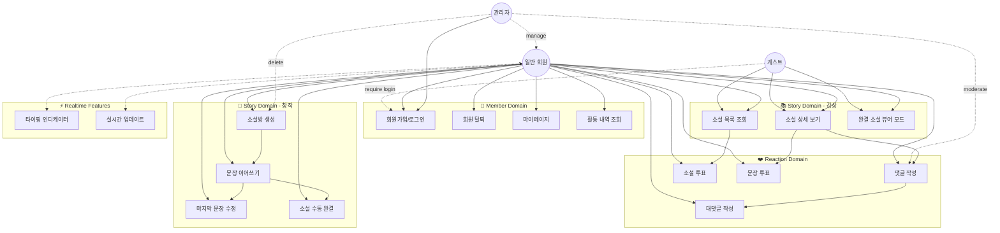
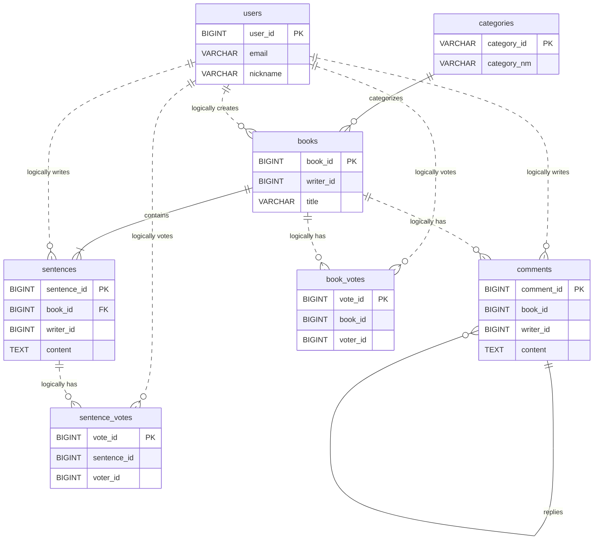
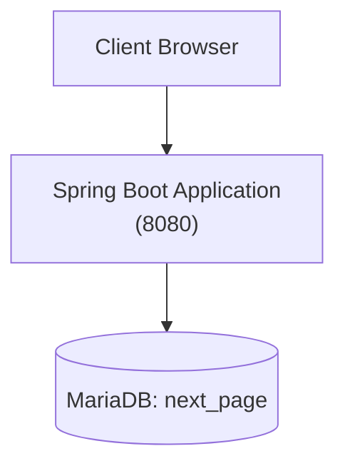
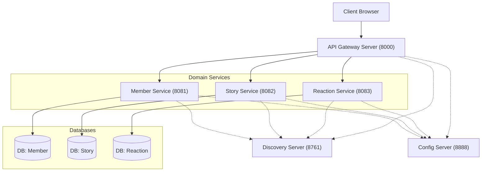
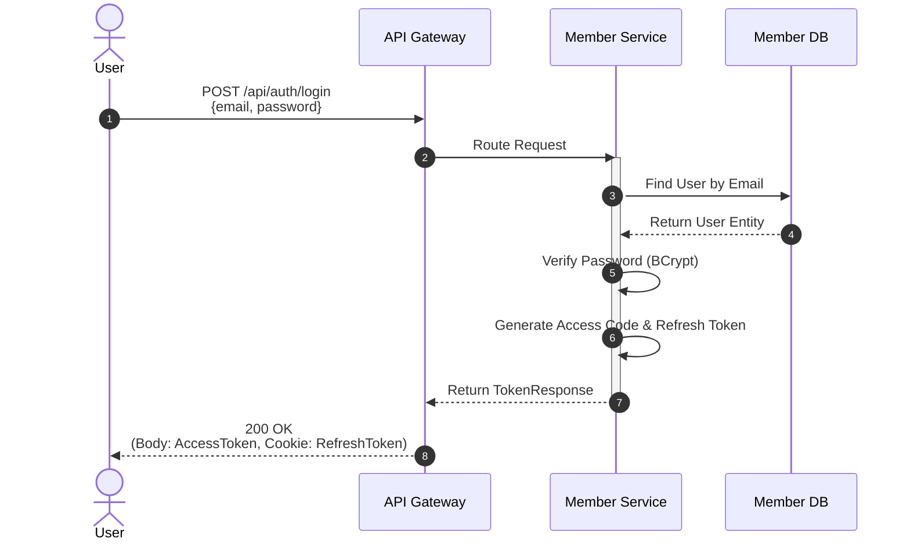
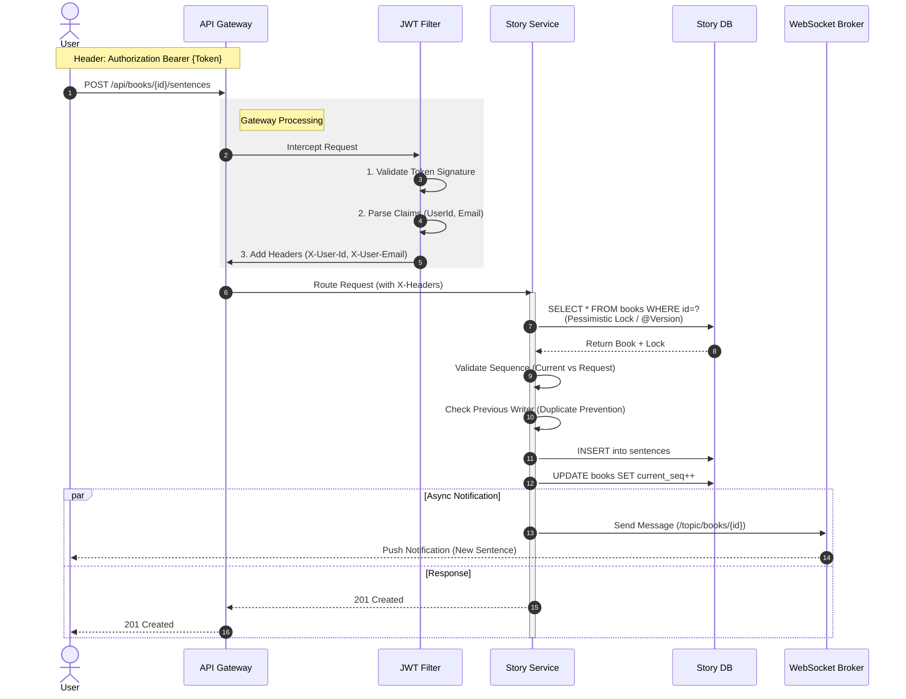
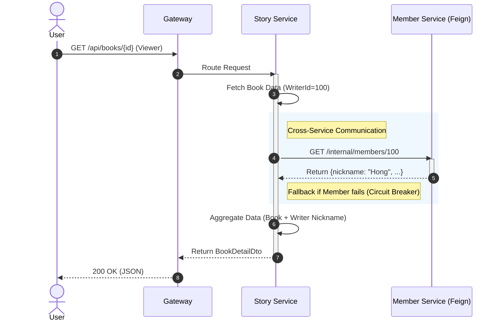

# 📚 Next Page : 우리가 함께 만드는 실시간 릴레이 소설
>
> **"당신의 한 문장이 베스트셀러의 시작이 됩니다."**
> 누구나 작가가 되어 실시간으로 소설을 완성하는 집단 지성 창작 플랫폼

**문서 구조:**

- **PART 1: 공통 (Common)** - 프로젝트 개요, 팀 구성, 기술 스택, 기능 명세
- **PART 2: AS-IS (Monolithic)** - 초기 단일 애플리케이션 아키텍처 (2025.12.23 ~ 2026.01.10)
- **PART 3: TO-BE (MSA)** - Microservices Architecture (2026.01.11 ~ 현재) ✅ 현재 운영

 

## 📑 목차

### PART 1: 공통 (Common)

1. [프로젝트 소개](#part-1-1-프로젝트-소개)
2. [팀원 및 역할 분담](#part-1-2-팀원-및-역할-분담)
3. [기술 스택](#part-1-3-기술-스택)
4. [주요 기능 & 유스케이스](#part-1-4-주요-기능--유스케이스)
5. [요구사항](#part-1-5-요구사항-정의서)
6. [ERD 설계](#part-1-6-erd-설계)
7. [Database Schema](#part-1-7-database-schema)
8. [팀 그라운드 룰 (XP)](#part-1-8-팀-그라운드-룰-xp)

### PART 2: AS-IS (Monolithic)

1. [Monolithic 아키텍처](#part-2-1-monolithic-아키텍처)
2. [Monolithic 실행 방법](#part-2-2-monolithic-실행-방법)
3. [Monolithic 패키지 구조](#part-2-3-monolithic-패키지-구조)

### PART 3: TO-BE (MSA) ✅

1. [MSA 아키텍처](#part-3-1-msa-아키텍처)
2. [MSA 시스템 구성도](#part-3-2-msa-시스템-구성도)
3. [MSA 전환 핵심 포인트](#part-3-3-msa-전환-핵심-포인트)
4. [MSA 시퀀스 다이어그램](#part-3-4-msa-시퀀스-다이어그램)
5. [실행 방법](#part-3-5-실행-방법)

 

---

# PART 1: 공통 (Common)

프로젝트 전반에 대한 개요, 팀 구성, 기술 스택, 기능 요구사항을 다룹니다.

---

## PART 1-1. 프로젝트 소개

**Next Page**는 한 사람이 모든 이야기를 쓰는 것이 아니라, 여러 사용자가 **문장 단위로 이어 쓰며 하나의 소설을 완성**하는 릴레이 창작 서비스입니다.

단순한 게시판이 아닙니다. **WebSocket을 활용한 실시간 타이핑 표시**, **순서(Sequence) 제어**, **투표 기반 평가**가 결합된 몰입형 창작 플랫폼입니다. 앞사람이 글을 완료해야만 뒷사람이 쓸 수 있는 **동시성 제어**와 **도메인 규칙**을 엄격하게 준수합니다.

### 📅 개발 기간

- **2025.12.23 ~ 2026.01.16** (총 4주)

### 🏗️ 아키텍처 변천

- **Phase 1 - Monolithic (2025.12.23 ~ 2026.01.10):** 단일 Spring Boot 애플리케이션
- **Phase 2 - MSA (2026.01.11 ~ 현재):** Microservices Architecture로 전환 완료 ✅

### 📊 프로젝트 진행 현황

| 기능 영역 | 상태 | 완료 항목 |
|:---:|:---:|:---|
| **⚡ 실시간/웹소켓** | ✅ 완료 | **실시간 타이핑/편집 잠금**, **댓글/문장 실시간 푸시**, STOMP 프로토콜 최적화 |
| **🔐 인증/인가** | ✅ 완료 | JWT, Refresh Token, 강제 로그인 모달, **Soft Delete(User)** |
| **👤 회원 관리** | ✅ 완료 | 회원가입/탈퇴, **실시간 입력값 검증**, 마이페이지 대시보드 |
| **📖 소설 집필** | ✅ 완료 | **문장 이어쓰기(순서 제어)**, **마지막 문장만 수정/삭제(Restriction)**, **편집 중 잠금(Lock)** |
| **📚 소설 조회** | ✅ 완료 | 무한 스크롤, 페이징/정렬, **책 넘김 효과 뷰어**, **내가 쓴 글/댓글 모아보기** |
| **❤️ 반응/평가** | ✅ 완료 | **실시간 댓글(WebSocket)**, 계층형 대댓글, 개추/비추 투표, Soft Delete(Comment) |
| **🏗️ MSA 전환** | ✅ 완료 | **Eureka**, **Gateway + JWT Filter**, **Feign Client**, 3개 DB 분리, **Application Level Join** |
| **🛡️ 안정성** | ✅ 완료 | **Resilience4j (Circuit Breaker)** 적용, 장애 전파 방지 및 Fallback 처리 |
| **API & Architecture** | ✅ 완료 | **HATEOAS**, CQRS, Swagger, **Dynamic Topic Routing (/topic/{bookId})** |
| **🎨 UI/UX** | ✅ 완료 | **Cute Pop 디자인**, 로고 폰트(Gaegu), 모달 UX 개선, 토스트 알림 |
| **🧪 테스트** | ✅ 완료 | 전체 API 시나리오 테스트 (`http/api-test.http`), 단위/통합 테스트 환경 |

 

---

## PART 1-2. 팀원 및 역할 분담

우리는 **도메인 주도 설계(DDD)** 원칙에 따라, 기능 단위가 아닌 **도메인(Context)** 단위로 역할을 분담하여 전문성을 높였습니다.

| 이름 | 포지션 | 담당 도메인 & 핵심 역할 |
|:---:|:---:|:---|
| **정진호** | **Team Leader** | **🏛 Core & Architecture** - 프로젝트 아키텍처 설계 (CQRS, WebSocket, MSA 전환) - 실시간 타이핑 및 알림 시스템 구현 - `Story` 애그리거트 상태/순서 제어 로직 **✍️ Writing & Query** - 문장 작성(Append) 및 유효성 검사 - 동적 쿼리(MyBatis) 기반 조회/검색 최적화 |
| **김태형** | **Sub Leader** | **🔐 Member & Auth** - Spring Security + JWT 인증/인가 시스템 - **Soft Delete**를 적용한 안전한 회원 탈퇴/관리 - 실시간 유효성 검증 로직 및 마이페이지 - MSA: member-service 구축 및 Internal API 제공 |
| **정병진** | **Developer** | **❤️ Reaction & Support** - **개추/비추(Thumb Up/Down)** 투표 시스템 - 계층형 댓글(대댓글) 구조 설계 및 구현 - 관리자 권한(댓글/유저 관리) 기능 구현 - MSA: reaction-service 구축 및 양방향 Feign 통합 |
| **최현지** | **Document Manager** | **📄 Documentation & QA** - 프로젝트 문서화 및 리드미(README) 관리 - API 명세 및 개발자 가이드 최신화 - 전체 기능 QA 및 시나리오 점검 |

 

---

## PART 1-3. 기술 스택

### 💻 개발 환경

- **IDE:** IntelliJ IDEA
- **JDK:** Java 17 (Amazon Corretto or Azul Zulu)
- **Database:** MariaDB 10.6+
- **Build Tool:** Gradle
- **Framework:** Spring Boot 3.5.9

### Backend & Real-time

### Frontend

### Architecture Strategy (공통 패턴)

- **RESTful API:** 자원(Resource) 중심의 명확한 URI 설계 및 HTTP Method 활용
- **CQRS Pattern:**
  - **Command (쓰기):** JPA (Domain Logic, Dirty Checking) - 데이터 무결성 보장
  - **Query (읽기):** MyBatis (Dynamic Query) - 복잡한 통계/조회 성능 최적화
- **Event-Driven:** WebSocket을 통한 실시간 상태 동기화 (작성 중, 댓글 작성 등)

 

---

## PART 1-4. 주요 기능 & 유스케이스

사용자와 관리자가 시스템에서 수행할 수 있는 주요 시나리오입니다.

### 🗺️ Use Case Diagram

### ⚡ 1. 실시간 인터랙션 (WebSocket)

- **실시간 타이핑 인디케이터:** 
  - 누군가 문장을 작성 중이면 다른 사용자들에게 "홍길동님이 문장을 쓰고 있어요..." 표시
  - 댓글 작성 중에도 동일하게 작동
  - 작성 중일 때 다른 사람의 입력 차단 (동시성 제어)
  
- **라이브 업데이트:** 
  - 새 소설이 생성되면 메인 페이지에 즉시 표시
  - 문장이 추가되면 읽고 있는 모든 사용자에게 실시간 반영
  - 댓글이 달리면 즉시 업데이트

### 🚀 2. 릴레이 소설 창작 시나리오

**전체 Flow:**
1. **소설방 개설** (작가A)
   - 제목, 장르, 최대 문장 수 설정
   - 첫 문장 작성 (예: "어느 날, 하늘에서 이상한 물체가 떨어졌다.")

2. **문장 이어쓰기** (작가B, C, D...)
   - 이전 문장을 읽고 다음 스토리 전개
   - **제약 조건:**
     - 직전 작성자는 연속으로 쓸 수 없음 (최소 1명 대기)
     - 현재 순서(sequence)만 작성 가능
     - 실시간 타이핑 중에는 다른 사람 입력 차단

3. **수정 규칙**
   - **마지막 문장만** 수정/삭제 가능 (스토리 일관성 유지)
   - 중간 문장 수정 불가 → 완결 후 전체 다운로드하여 2차 창작 가능

4. **완결**
   - 자동 완결: 최대 문장 수 도달 시
   - 수동 완결: 방장이 임의로 완결 처리
   - 완결 후 뷰어 모드로 전환

### ❤️ 3. 평가 및 소통

- **계층형 댓글:** 
  - 부모 댓글과 대댓글 구조 (depth 제한 없음)
  - Soft Delete로 삭제된 댓글도 "[삭제된 댓글입니다]"로 구조 유지
  
- **투표 시스템:**
  - 소설 전체 평가: 좋아요(개추) / 싫어요(비추)
  - 문장별 평가: 베스트 문장 선정
  - 1인 1투표, 토글 방식 (취소 가능)

### 🎯 4. 사용자 여정 (User Journey)

**신규 사용자 (게스트) → 활발한 작가**
1. 소설 목록 둘러보기 (비로그인 가능)
2. 재미있는 소설 발견 → 회원가입 모달 표시
3. 회원가입 (이메일 중복 체크, 비밀번호 강도 검증)
4. 로그인 후 자동으로 소설 상세 페이지 이동
5. 문장 이어쓰기 → 실시간 타이핑 경험
6. 마이페이지에서 내 활동 확인
7. 새 소설방 개설 → 커뮤니티 확장

 

---

## PART 1-5. 상세 요구사항 정의서 (Detailed Requirements)

프로젝트 분석 결과에 따른 완전한 기능(Functional) 및 비기능(Non-Functional) 요구사항 명세입니다.

### 📋 1. 기능 요구사항 (Functional Requirements)

#### 🔐 회원 및 인증 (Member & Auth)
| ID | 분류 | 요구사항 명 | 상세 내용 | 비고 |
|:---:|:---:|:---:|:---|:---|
| **FR-M01** | **Auth** | 이메일 회원가입 | 이메일, 비밀번호, 닉네임 입력. 이메일 형식(Regex) 및 비밀번호 복잡도(8자 이상, 특수문자 포함) 검증 | 실시간 중복 체크 |
| **FR-M02** | **Auth** | 로그인 | 이메일/비밀번호 인증. 성공 시 JWT Access Token(Body) 및 Refresh Token(Cookie) 발급 | Access: 1h, Refresh: 7d |
| **FR-M03** | **Auth** | 토큰 재발급 (Silent Refresh) | Access Token 만료 시, HttpOnly Cookie의 Refresh Token으로 인증하여 Access Token 재발급 | 보안 강화 |
| **FR-M04** | **Auth** | 로그아웃 | Refresh Token 쿠키 삭제 및 만료 처리. 클라이언트 측 Access Token 폐기 | - |
| **FR-M05** | **Member** | 내 정보 조회 (마이페이지) | 본인의 닉네임, 이메일, 가입일, 활동 통계(작성한 소설/문장/댓글 수) 조회 | - |
| **FR-M06** | **Member** | 내 활동 내역 조회 | 내가 작성한 소설, 문장, 댓글 리스트 페이징 조회 (최신순) | 탭(Tab) 구분 |
| **FR-M07** | **Member** | 회원 정보 수정 | 닉네임 변경 가능 (중복 검사 포함). 비밀번호 변경 기능 | - |
| **FR-M08** | **Member** | 회원 탈퇴 | DB에서 물리적 삭제가 아닌, 상태값(`status`)을 `DELETED`로 변경하는 **Soft Delete** 처리 | 30일 후 영구 삭제 가능 |

#### 📖 소설 및 창작 (Story & Writing)
| ID | 분류 | 요구사항 명 | 상세 내용 | 비고 |
|:---:|:---:|:---:|:---|:---|
| **FR-S01** | **Story** | 소설방 생성 | 제목, 카테고리(스릴러/로맨스/판타지 등), 최대 문장 수 설정하여 생성 | 초기 커버 이미지 랜덤 배정 |
| **FR-S02** | **Story** | 소설 목록 조회 | 무한 스크롤(Infinite Scroll) 기반 페이징. 최신순/인기순(참여자수/조회수) 정렬 | 검색/필터 지원 |
| **FR-S03** | **Story** | 소설 상세/정보 조회 | 소설 메타데이터(작가, 진행률 등) 및 참여자 리스트 조회 | 실시간 업데이트 |
| **FR-S04** | **Writing** | 문장 이어쓰기 (Append) | 현재 순서(`current_seq`)에 맞춰 새 문장 작성. **직전 작성자 연속 작성 불가** 규칙 적용 | 동시성 제어 (Lock) |
| **FR-S05** | **Writing** | 입력 유효성 검증 | 문장 길이 제한(10~200자), 비속어 필터링(선택적), 공백 제외 유효 글자 수 체크 | - |
| **FR-S06** | **Writing** | 문장 수정 | **자신이 쓴 마지막 문장**이면서, 뒤에 이어진 문장이 없을 때만 수정 가능 | 스토리 무결성 보장 |
| **FR-S07** | **Writing** | 문장 삭제 | **자신이 쓴 마지막 문장**에 한해 삭제 가능. 삭제 시 소설의 `current_seq` 롤백 | - |
| **FR-S08** | **Story** | 자동 완결 | 설정된 `max_sequence`에 도달하면 소설 상태가 `COMPLETED`로 자동 변경 | - |
| **FR-S09** | **Story** | 수동 완결 | 방장(최초 생성자) 권한으로 소설 조기 완결 처리 가능 | - |
| **FR-S10** | **Viewer** | 완결 작품 뷰어 | 책 넘김 효과(Page Flip) 또는 스크롤 모드로 전체 스토리 정주행 | UX 최적화 |

#### ❤️ 반응 및 커뮤니티 (Reaction)
| ID | 분류 | 요구사항 명 | 상세 내용 | 비고 |
|:---:|:---:|:---:|:---|:---|
| **FR-R01** | **Comment** | 소설 댓글 작성 | 특정 소설에 대한 댓글 작성. 이모지 포함 가능 | - |
| **FR-R02** | **Comment** | 대댓글 (Reply) | 댓글에 대한 답글 작성 (계층형 구조 지원) | Depth 제한 없음 |
| **FR-R03** | **Comment** | 댓글 삭제 | 본인 작성 댓글 삭제. 대댓글이 있는 경우 "삭제된 메시지입니다" 로 내용만 마스킹 처리 | 대댓글 보존 |
| **FR-R04** | **Vote** | 소설 개추/비추 | 소설 전체에 대한 좋아요/싫어요 투표. 1인 1투표, 토글(취소) 및 변경 가능 | - |
| **FR-R05** | **Vote** | 문장 투표 | 특정 문장에 대한 좋아요 투표. "베스트 문장" 선정에 활용 | - |

#### ⚡ 실시간 인터랙션 (Real-time)
| ID | 분류 | 요구사항 명 | 상세 내용 | 비고 |
|:---:|:---:|:---:|:---|:---|
| **FR-RT01** | **Socket** | 문장 타이핑 알림 | 사용자가 문장 입력창에 타이핑 시, 타 사용자에게 "OOO님이 입력 중.." 표시 (Debounce 적용) | WebSocket (STOMP) |
| **FR-RT02** | **Socket** | 댓글 타이핑 알림 | 댓글 작성 중인 상태 실시간 공유 | - |
| **FR-RT03** | **Socket** | 실시간 문장 로딩 | 누군가 문장을 등록 완료하면(Commit), 새로고침 없이 화면에 즉시 문장 카드가 생성 | - |
| **FR-RT04** | **Socket** | 실시간 댓글 로딩 | 누군가 댓글 등록 시 리스트에 즉시 반영 | - |
| **FR-RT05** | **Socket** | 동시 편집 방지 (Lock) | 한 명이 작성 중(Typing 상태)일 때 타인의 입력창을 비활성화하여 충돌 방지 (선택적 UX) | - |

#### 🛠️ 시스템 및 관리자 (System & Admin)
| ID | 분류 | 요구사항 명 | 상세 내용 | 비고 |
|:---:|:---:|:---:|:---|:---|
| **FR-SYS01** | **Infra** | 서비스 검색(Discovery) | 모든 마이크로서비스는 Eureka Server에 자동 등록 및 헬스 체크 | 동적 스케일링 대비 |
| **FR-SYS02** | **Gateway** | 요청 라우팅 | 단일 엔드포인트(Port 8000)로 모든 요청 수신 후 서비스별 라우팅 (`/api/members`, `/api/books` 등) | - |
| **FR-SYS03** | **Infra** | 중앙 설정 관리 | Config Server를 통해 `application.yml` 설정 중앙화 및 동적 갱신(Refresh) 지원 | 보안 민감정보 암호화 |
| **FR-AD01** | **Admin** | 컨텐츠 관리 | (Admin 전용) 부적절한 소설/댓글 블라인드 또는 강제 삭제 처리 | - |
| **FR-AD02** | **Admin** | 회원 관리 | (Admin 전용) 악성 유저 정지 및 강제 탈퇴 처리 | - |

 

### 🛡️ 2. 비기능 요구사항 (Non-Functional Requirements)

| ID | 분류 | 요구사항 명 | 상세 구현 내용 | 중요도 |
|:---:|:---:|:---:|:---|:---:|
| **NFR-01** | **Reliability** | **Circuit Breaker** | 타 서비스 장애(Timeout/Fail) 시 즉시 에러를 전파하지 않고 Fallback(기본값) 반환 | 상 |
| **NFR-02** | **Security** | **Stateless Auth** | 세션을 사용하지 않고 JWT + Gateway Filter 기반의 무상태 인증 아키텍처 구현 | 상 |
| **NFR-03** | **Performance** | **Traffic Splitting** | 쓰기(Command)와 읽기(Query) 트래픽을 분리하여 조회 성능 최적화 (CQRS) | 중 |
| **NFR-04** | **Performance** | **Async Processing** | 알림, 통계 집계 등 비동기 작업은 Event Driven 방식으로 처리 (추후 Kafka 도입 고려) | 중 |
| **NFR-05** | **Scalability** | **DB Isolation** | 서비스별 전용 DB(Schema)를 사용하여 결합도 제거 및 독립적 확장 보장 | 상 |
| **NFR-06** | **Observability**| **API Tracing** | Gateway에서 생성한 Request ID를 전파하여 분산 로그 추적 가능하게 설계 | 중 |
| **NFR-07** | **UX** | **Reactive UI** | 모든 데이터 변경(생성/삭제)에 대해 페이지 새로고침 없는 Ajax/WebSocket 갱신 보장 | 상 |
| **NFR-08** | **Code** | **Standardization** | 구글 자바 스타일 가이드 준수, Checkstyle 적용, 통합된 ErrorResponse 포맷 사용 | 하 |

 

---

## PART 1-6. ERD 설계

### 도메인 엔티티 관계 (MSA Version)

MSA 아키텍처에 맞춰 3개의 데이터베이스로 분리된 구조를 반영했습니다. 서비스 간 관계는 물리적 FK가 아닌 **논리적 참조(Logical Reference)**로 연결됩니다.

 

---

## PART 1-7. Database Schema

### 🔄 MSA Database Structure

**Database per Service** 패턴을 적용하여, 각 마이크로서비스는 독립적인 데이터베이스를 소유합니다.

| 서비스 | 데이터베이스명 | 주요 테이블 |
|:---:|:---|:---|
| **Member Service** | `next_page_member` | `users`, `refresh_token` |
| **Story Service** | `next_page_story` | `books`, `sentences`, `categories` |
| **Reaction Service** | `next_page_reaction` | `comments`, `book_votes`, `sentence_votes` |

---

## PART 1-8. 팀 그라운드 룰 (XP)

우리 팀은 **Extreme Programming (XP)** 의 가치를 지향하며, 효율적이고 건강한 협업 문화를 만들기 위해 노력합니다.

[👉 팀 그라운드 룰 상세 보기 (GROUND_RULES.md)](GROUND_RULES.md)

- **의사소통:** 상시 공유와 구체적인 질문
- **단순성:** 가독성 좋은 코드와 명확한 설계
- **피드백:** 상호 존중 기반의 코드 리뷰
- **용기:** 문제 공유 및 적극적인 개선 제안
- **존중:** 사람 중심이 아닌 기술 중심의 논의

 

---

# PART 2: AS-IS (Monolithic Architecture)

초기 버전의 단일 애플리케이션 아키텍처 (2025.12.23 ~ 2026.01.10)

---

## PART 2-1. Monolithic 아키텍처

### 시스템 구성도

### 특징

✅ **장점:** 단순한 배포, 트랜잭션 관리 용이, 빠른 프로토타이핑
❌ **한계:** 낮은 확장성, 장애 전파, 기술 종속성

---

## PART 2-2. Monolithic 실행 방법

⚠️ **상세한 설치 및 실행 가이드, 패키지 구조는 [DEVELOPER_GUIDE.md](DEVELOPER_GUIDE.md)를 참고하세요.**

---

## PART 2-3. Monolithic 패키지 구조

**(생략 - 가이드 문서 참고)**

---

# PART 3: TO-BE (MSA Architecture) ✅ 현재 운영

Microservices Architecture 전환 (2026.01.11 ~)

---

## PART 3-1. MSA 아키텍처

### 전환 배경

1. **확장성:** 특정 기능만 스케일링 불가 (전체 재배포 필요)
2. **장애 격리:** 부분 장애 시 전체 시스템 다운
3. **배포:** 작은 변경도 전체 재배포 필요
4. **팀 협업:** 도메인별 독립 개발 어려움

### 전환 일정

| 날짜 | 작업 | 상태 |
|:---:|:---|:---:|
| 2026-01-11 | Discovery Server, Gateway 구축 | ✅ |
| 2026-01-12 | DB 3개 분리 (member, story, reaction) | ✅ |
| 2026-01-13 | member-service 이관 | ✅ |
| 2026-01-14 | story-service, reaction-service 이관 | ✅ |
| 2026-01-15 | Config Server, Actuator, Feign 적용 | ✅ |

---

## PART 3-2. MSA 시스템 구성도

### 서비스별 책임

| 서비스 | 포트 | 주요 책임 |
|:---:|:---:|:---|
| **Config Server** | 8888 | 중앙 설정 관리 (Git Repository 연동) |
| **Discovery Server** | 8761 | Eureka: 서비스 등록/탐색 |
| **Gateway Server** | 8000 | JWT 검증, 라우팅, 헤더 주입 (X-User-Id) |
| **Member Service** | 8081 | 회원가입/로그인, JWT 발급, 회원 정보 관리 |
| **Story Service** | 8082 | 소설 생성/조회, 문장 이어쓰기, WebSocket |
| **Reaction Service** | 8083 | 댓글/대댓글, 개추/비추 투표 |

---

## PART 3-3. MSA 전환 핵심 포인트

1. **Config Server 도입**: 모든 설정(`application.yml`)을 Git에서 중앙 관리.
2. **JPA 객체 참조 → ID 참조 전환**: 서비스 간 결합도 제거.
3. **Application Level Join**: 복잡한 연관관계를 Feign Client로 해결.
4. **Gateway JWT 필터**: 인증/인가 로직을 Gateway로 이관하여 마이크로서비스는 비즈니스 로직에 집중.

---

## PART 3-4. MSA 시퀀스 다이어그램

시스템의 핵심 흐름(Key Flows)을 보여주는 시퀀스 다이어그램입니다.

### 1. 인증 프로세스 & JWT 필터 (Authentication Flow)

사용자가 로그인하여 토큰을 발급받는 과정입니다.

### 2. 핵심 로직: 문장 이어쓰기 (Core Feature with Filter)

**Gateway Filter**가 헤더를 변환하고, **Story Service**가 동시성을 제어하며, **WebSocket**이 실시간 전파하는 전체 흐름입니다.

### 3. MSA 통신: 데이터 통합 조회 (Cross-Service Aggregation)

소설 조회 시 **Feign Client**를 통해 타 서비스(Member)의 데이터를 조회하고 병합하는 과정입니다.

---

## PART 3-5. 실행 방법

⚠️ **데이터베이스 설정, 실행 순서, 환경 설정 등 상세 가이드는 [DEVELOPER_GUIDE.md](DEVELOPER_GUIDE.md)를 확인하세요.**

---

## 📚 API 명세 (API Specification)

상세한 REST API 명세(Request/Response 규격)는 별도 문서로 관리됩니다.
[👉 API 상세 명세서 보러가기 (next-page-msa/API_SPECIFICATION.md)](next-page-msa/API_SPECIFICATION.md)

---

Copyright © 2026 **Team Next Page**. All rights reserved.
