# 📚 Next Page : 우리가 함께 만드는 이야기
> **"당신의 한 문장이 베스트셀러의 시작이 됩니다."**  
> 누구나 작가가 되어 릴레이로 소설을 완성하는 집단 지성 창작 플랫폼

<br>

## 1. 📝 프로젝트 소개
**Next Page**는 한 사람이 모든 이야기를 쓰는 것이 아니라, 여러 사용자가 **문장 단위로 이어 쓰며 하나의 소설을 완성**하는 릴레이 창작 서비스입니다.

단순한 게시판이 아닙니다. **순서(Sequence)와 상태(Status) 관리**가 핵심인 이 프로젝트는, 앞사람이 글을 완료해야만 뒷사람이 쓸 수 있는 **동시성 제어**와 **도메인 규칙**을 엄격하게 준수합니다.

### 📅 개발 기간
* **2026.XX.XX ~ 2026.XX.XX (N주)**

<br>

## 2. 👥 팀원 및 역할 분담 (Team Next Page)
우리는 **도메인 주도 설계(DDD)** 원칙에 따라, 기능 단위가 아닌 **도메인(Context)** 단위로 역할을 분담하여 전문성을 높였습니다.

| 이름 | 포지션 | 담당 도메인 & 핵심 역할 |
|:---:|:---:|:---|
| **정진호** | **Team Leader** | **🏛 Core & Architecture**<br>- 프로젝트 아키텍처 설계 (CQRS 패턴 적용)<br>- `Story` 애그리거트 상태 관리 및 순서 제어 로직<br>- 전역 예외 처리 및 공통 응답 포맷 정의 |
| **김태형** | **Sub Leader** | **🔐 Member & Auth**<br>- Spring Security 기반 인증/인가 (회원가입, 로그인)<br>- **Soft Delete**를 적용한 안전한 회원 탈퇴 처리<br>- 마이페이지 (내 서재, 프로필 관리) |
| **최현지** | **Core Dev** | **✍️ Writing (Command)**<br>- 문장 작성(Append) 비즈니스 로직 구현<br>- 연속 작성 방지 및 입력 데이터 유효성 검사(Validation)<br>- 이야기 완결(State Transition) 처리 |
| **윤성원** | **Core Dev** | **📖 Reading (Query)**<br>- 소설 조회 및 검색 최적화 (Read Model 설계)<br>- 장르별/인기별 필터링 및 페이징 처리<br>- 완성된 소설 '책 뷰' 렌더링 API |
| **정병진** | **Developer** | **❤️ Reaction & Support**<br>- 소설 개추/비추(LIKE/DISLIKE) 투표 기능<br>- 문장별 댓글 및 감상평 CRUD<br>- UI/UX 인터랙션 요소 개발 지원 |

<br>

## 3. 🛠️ 기술 스택 (Tech Stack)

### Backend


### Architecture Strategy
*   **RESTful API:** 자원(Resource) 중심의 명확한 URI 설계 및 HTTP Method 활용
*   **DDD (Domain-Driven Design):** 비즈니스 로직을 Service가 아닌 **Entity(도메인 객체)에 위임**하여 응집도 강화
*   **CQRS (Command Query Responsibility Segregation):**
    *   **Command (쓰기):** 데이터 무결성이 중요한 로직 (JPA Dirty Checking 활용)
    *   **Query (읽기):** 조회 성능 최적화를 위한 별도 DTO 조회 로직 분리

<br>

## 4. ✨ 주요 기능 (Key Features)

### 🚀 1. 릴레이 소설 창작 (Core)
*   **이야기 시작:** 제목, 장르, 첫 문장을 등록하여 방을 개설합니다.
*   **이어 쓰기 (Sequence Control):**
    *   현재 순서(`current_sequence`)인 경우에만 작성 권한이 부여됩니다.
    *   **연속 작성 금지:** 바로 앞 문장을 쓴 사람은 연달아 쓸 수 없습니다. (`last_writer_id` 체크)
*   **자동 완결:** 설정된 최대 문장 수에 도달하면 이야기는 `COMPLETED` 상태로 잠깁니다.

### 📚 2. 완결 소설 서재 (Query)
*   **명예의 전당:** 완결된 소설은 별도의 '서재' 공간에 전시됩니다.
*   **뷰어 모드:** 문장 단위가 아닌, 한 권의 책을 읽는 듯한 매끄러운 뷰를 제공합니다.

### 🔐 3. 회원 서비스 (Soft Delete)
*   **안전한 탈퇴:** 회원이 탈퇴해도 작성한 문장은 사라지지 않습니다.
*   **상태 관리:** 탈퇴한 회원의 닉네임은 "탈퇴한 사용자"로 표시되어 소설의 맥락을 유지합니다.

### ❤️ 4. 소통 및 평가
*   **개추/비추:** 소설에 대해 `LIKE` 또는 `DISLIKE`로 투표할 수 있습니다. (1인 1투표 제한)
*   **감상평:** 소설에 댓글을 남겨 작가들과 소통할 수 있습니다.

<br>

## 5. 🗂️ ERD 설계 (Entity Relationship)
`users`의 Soft Delete 상태값과 역할별로 명확히 구분된 FK(`writer_id`, `voter_id`) 구조입니다.

```mermaid
erDiagram
    users ||--o{ books : "writer_id (생성)"
    users ||--o{ sentences : "writer_id (작성)"
    users ||--o{ comments : "writer_id (작성)"
    users ||--o{ book_votes : "voter_id (투표)"
    users ||--o{ sentence_votes : "voter_id (투표)"

    categories ||--o{ books : "category_id (분류)"

    books ||--|{ sentences : contains
    books ||--o{ comments : has
    books ||--o{ book_votes : has
    sentences ||--o{ sentence_votes : has

    users {
        int user_id PK
        varchar user_email
        varchar user_nicknm
        varchar user_status "ACTIVE/DELETED"
    }
    
    books {
        int book_id PK
        int writer_id FK
        varchar category_id FK
        int last_writer_id FK
        string status "WRITING/COMPLETED"
    }

    sentences {
        int sentence_id PK
        int book_id FK
        int writer_id FK
        int sequence_no
    }
    
    book_votes {
        int vote_id PK
        int book_id FK
        int voter_id FK
        varchar vote_type "LIKE/DISLIKE"
        datetime created_at
    }

    sentence_votes {
        int vote_id PK
        int sentence_id FK
        int voter_id FK
        varchar vote_type "LIKE/DISLIKE"
        datetime created_at
    }

    comments {
        int comment_id PK
        int book_id FK
        int writer_id FK
        text content
        datetime created_at
        datetime updated_at
    }

    categories {
        varchar category_id PK
        varchar category_nm
    }
```



<br>

## 6. 💾 Database Schema (DDL)

프로젝트 초기 설정을 위한 MariaDB DDL 스크립트입니다.

<details>
<summary>👉 <b>Click to view SQL Script</b></summary>

```sql
-- 1. 사용자 (Users)
CREATE TABLE `users` (
    `user_id`      INT          NOT NULL AUTO_INCREMENT,
    `user_email`   VARCHAR(100) NOT NULL COMMENT '로그인 ID',
    `user_pw`      VARCHAR(255) NOT NULL,
    `user_nicknm`  VARCHAR(50)  NOT NULL,
    `user_role`    VARCHAR(20)  NOT NULL DEFAULT 'USER',
    `user_status`  VARCHAR(20)  NOT NULL DEFAULT 'ACTIVE' COMMENT 'ACTIVE, DELETED',
    `left_at`      DATETIME     NULL COMMENT '탈퇴일시',
    `created_at`   DATETIME     NOT NULL DEFAULT NOW(),
    `updated_at`   DATETIME     NULL,
    PRIMARY KEY (`user_id`),
    UNIQUE KEY `uk_users_email` (`user_email`),
    UNIQUE KEY `uk_users_nicknm` (`user_nicknm`)
);

-- 2. 카테고리 (Categories)
CREATE TABLE `categories` (
    `category_id` VARCHAR(20) NOT NULL COMMENT 'PK: THRILLER, ROMANCE',
    `category_nm` VARCHAR(50) NOT NULL,
    PRIMARY KEY (`category_id`)
);

-- 3. 소설 (Books)
CREATE TABLE `books` (
    `book_id`             INT          NOT NULL AUTO_INCREMENT,
    `writer_id`           INT          NOT NULL,
    `category_id`         VARCHAR(20)  NOT NULL,
    `title`               VARCHAR(200) NOT NULL,
    `status`              VARCHAR(20)  NOT NULL DEFAULT 'WRITING',
    `current_sequence`    INT          NOT NULL DEFAULT 1,
    `max_sequence`        INT          NOT NULL DEFAULT 20,
    `last_writer_user_id` INT          NULL COMMENT '연속 작성 방지',
    `created_at`          DATETIME     NOT NULL DEFAULT NOW(),
    `updated_at`          DATETIME     NULL,
    PRIMARY KEY (`book_id`)
);

-- 4. 문장 (Sentences)
CREATE TABLE `sentences` (
    `sentence_id` INT      NOT NULL AUTO_INCREMENT,
    `book_id`     INT      NOT NULL,
    `writer_id`   INT      NOT NULL,
    `content`     TEXT     NOT NULL,
    `sequence_no` INT      NOT NULL,
    `created_at`  DATETIME NOT NULL DEFAULT NOW(),
    PRIMARY KEY (`sentence_id`)
);

-- 5. 댓글 (Comments)
CREATE TABLE `comments` (
    `comment_id` INT      NOT NULL AUTO_INCREMENT,
    `book_id`    INT      NOT NULL,
    `writer_id`  INT      NOT NULL,
    `content`    TEXT     NOT NULL,
    `created_at` DATETIME NOT NULL DEFAULT NOW(),
    `updated_at` DATETIME NULL,
    PRIMARY KEY (`comment_id`)
);

-- 6. 소설 투표 (Book Votes)
CREATE TABLE `book_votes` (
    `vote_id`    INT         NOT NULL AUTO_INCREMENT,
    `book_id`    INT         NOT NULL,
    `voter_id`   INT         NOT NULL,
    `vote_type`  VARCHAR(10) NOT NULL COMMENT 'LIKE, DISLIKE',
    `created_at` DATETIME    NOT NULL DEFAULT NOW(),
    PRIMARY KEY (`vote_id`),
    UNIQUE KEY `uk_book_voter` (`book_id`, `voter_id`),
    CONSTRAINT `chk_book_vote_type` CHECK (`vote_type` IN ('LIKE', 'DISLIKE'))
);

-- 7. 문장 투표 (Sentence Votes)
CREATE TABLE `sentence_votes` (
    `vote_id`     INT         NOT NULL AUTO_INCREMENT,
    `sentence_id` INT         NOT NULL,
    `voter_id`    INT         NOT NULL,
    `vote_type`   VARCHAR(10) NOT NULL COMMENT 'LIKE, DISLIKE',
    `created_at`  DATETIME    NOT NULL DEFAULT NOW(),
    PRIMARY KEY (`vote_id`),
    UNIQUE KEY `uk_sentence_voter` (`sentence_id`, `voter_id`),
    CONSTRAINT `chk_sentence_vote_type` CHECK (`vote_type` IN ('LIKE', 'DISLIKE'))
);
```
</details>

<br>

## 7. 🔌 API 명세 (Endpoint Example)

| Method | URI | 설명 | 권한 |
|:---:|:---|:---|:---:|
| POST | `/api/auth/signup` | 신규 작가 등록 (회원가입) | All |
| POST | `/api/auth/login` | 로그인 | All |
| POST | `/api/books` | 새로운 이야기 시작 (방 만들기) | User |
| GET | `/api/books` | 이야기 목록 조회 (필터링) | All |
| POST | `/api/books/{bookId}/sentences` | 문장 이어 쓰기 (핵심 기능) | User |
| GET | `/api/books/{bookId}` | 소설 상세 조회 (문장 전체) | All |
| POST | `/api/books/{bookId}/votes` | 소설 개추/비추 (LIKE/DISLIKE) | User |

<br>

## 8. ⚙️ 프로젝트 컨벤션 (Convention)

### Commit Message
*   `feat`: 새로운 기능 추가
*   `fix`: 버그 수정
*   `docs`: 문서 수정
*   `style`: 코드 포맷팅, 세미콜론 누락 등 (로직 변경 X)
*   `refactor`: 코드 리팩토링
*   `test`: 테스트 코드 추가
*   `chore`: 빌드 업무, 패키지 매니저 수정

### Branch Strategy
*   `main`: 배포 가능한 안정 버전
*   `develop`: 개발 중인 최신 버전
*   `feature/{domain}/{function}`: 기능 단위 개발 브랜치
    *   Ex) `feature/member/login`, `feature/book/create`

### 🌳 SourceTree 사용 가이드 (Branch Workflow)
소스트리를 사용하여 위 브랜치 전략을 따르는 방법입니다.

1.  **브랜치 생성 (Create Branch)**
    *   상단 메뉴의 **[브랜치]** 버튼 클릭
    *   **새 브랜치 이름:** `feature/기능명` 입력 (예: `feature/member/login`)
    *   **기준 브랜치 (Checkout):** `develop` 선택
    *   '브랜치 생성' 클릭 (자동으로 해당 브랜치로 체크아웃됨)

2.  **작업 및 커밋 (Commit)**
    *   코드 수정 후, **파일 상태** 탭에서 스테이지에 올리기
    *   하단 커밋 메시지 창에 컨벤션에 맞춰 메시지 입력 (예: `feat: 회원가입 기능 구현`)
    *   **[커밋]** 버튼 클릭

3.  **푸시 (Push)**
    *   상단 메뉴의 **[푸시]** 버튼 클릭
    *   현재 작업한 `feature/...` 브랜치 체크 후 푸시 (원격 저장소에 업로드)

4.  **풀 리퀘스트 (Pull Request)**
    *   GitHub/GitLab 웹사이트로 이동
    *   `feature/...` 브랜치에서 `develop` 브랜치로 **Merge Request (PR)** 생성
    *   팀원 리뷰 후 Merge 승인

<br>

---
Copyright © 2026 **Team Next Page**. All rights reserved.
