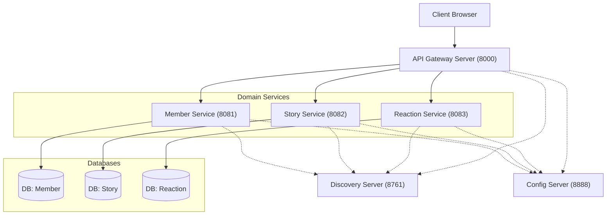
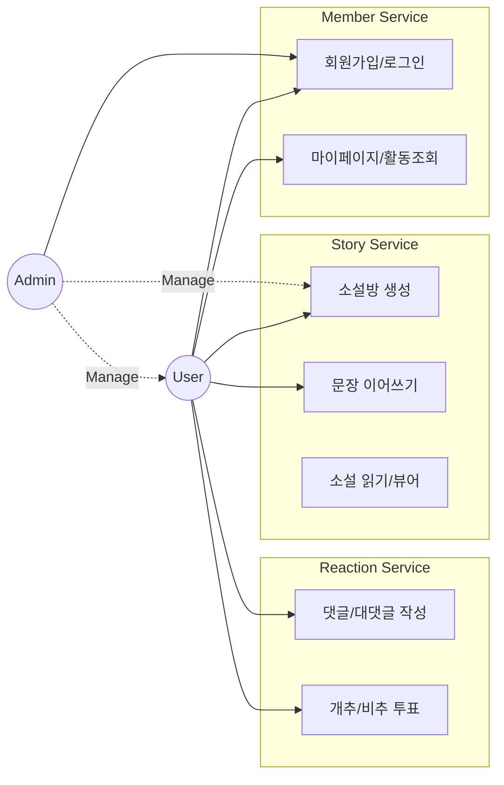
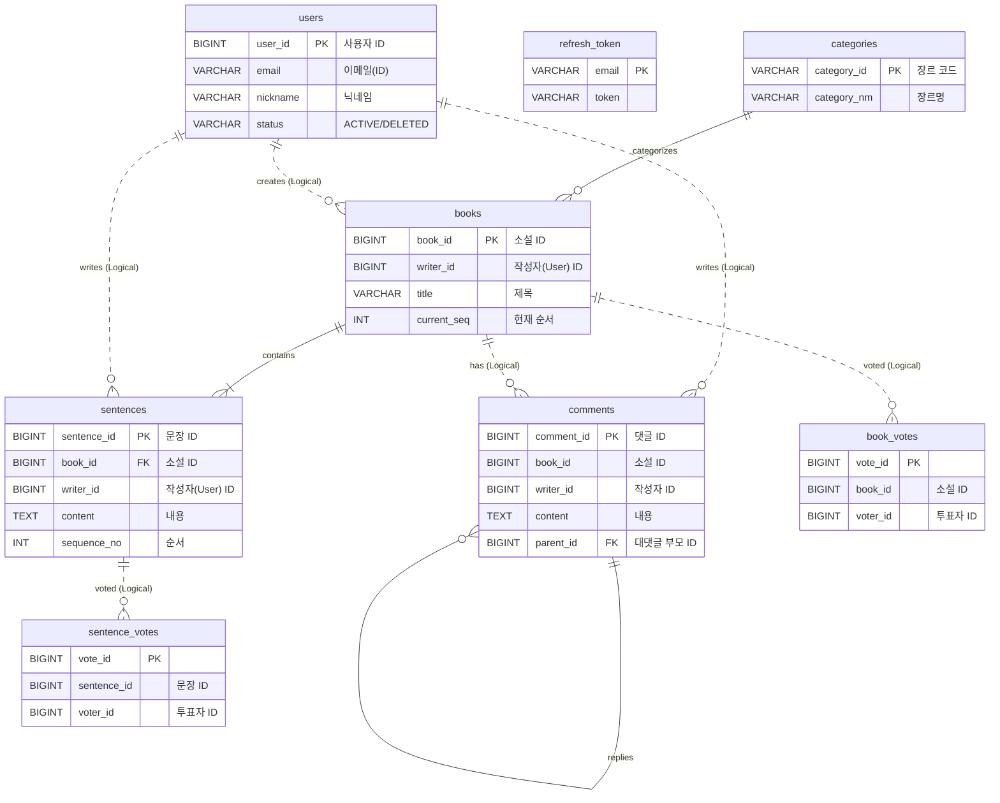
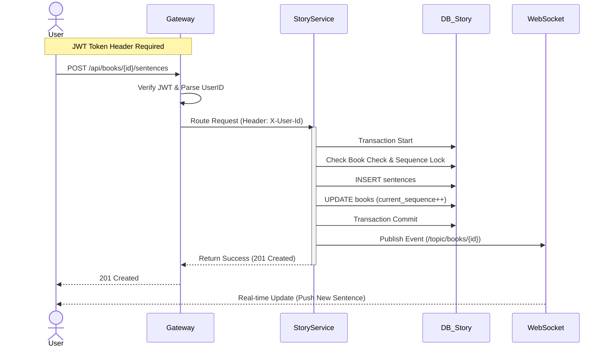

# 🏗️ Next Page : Microservices Architecture (MSA) Project

> **우리가 함께 만드는 실시간 릴레이 소설 - MSA 버전**
> 본 디렉토리는 `next-page` 모놀리식 프로젝트를 3개의 도메인 서비스와 인프라 서비스로 분리한 전문 MSA 프로젝트입니다.

---

## 📑 프로젝트 개요

- **목적:** 도메인 기반 서비스 분리를 통한 확장성, 장애 격리, 독립 배포 가능한 시스템 구축
- **아키텍처:** Spring Cloud 기반 Microservices Architecture
- **전환 배경:** Monolithic의 한계 극복 - 부분 장애 시 전체 시스템 다운, 확장성 제한, 배포 복잡도
- **핵심 기술:** 
  - **Service Discovery:** Netflix Eureka (서비스 자동 등록/탐색)
  - **API Gateway:** Spring Cloud Gateway (JWT 인증, 라우팅, 헤더 주입)
  - **Configuration:** Spring Cloud Config (Git 기반 중앙 설정 관리)
  - **Communication:** OpenFeign + Resilience4j (서비스 간 통신 및 Circuit Breaker)
  - **Database:** MariaDB (Database per Service 패턴, 3개 독립 DB)
  - **Real-time:** WebSocket (STOMP) - 타이핑 인디케이터, 실시간 업데이트

---

## 🏗️ 시스템 구성도



---

## 🗺️ Use Case Scenario

사용자와 관리자가 시스템에서 수행할 수 있는 주요 시나리오입니다.



---

## 💾 ERD (Entity Relationship Diagram)

MSA 환경에 맞춰 **Database per Service** 패턴이 적용된 구조입니다. 서비스 간 참조는 ID(Logical Reference)로만 이루어집니다.



---

## 🔄 Sequence Diagram: 문장 이어쓰기

사용자가 문장을 작성하고 실시간으로 반영되는 전체 흐름입니다.



---

## 🚦 시작하기 (Quick Start)

### 📋 사전 요구사항 (Prerequisites)

1. **JDK 17+** (Amazon Corretto 또는 Azul Zulu 권장)
2. **MariaDB 10.6+** (3개의 독립 데이터베이스 필요)
3. **Git** (Config Server 설정용)
4. **Gradle 8.5+** (wrapper 포함)

### 1️⃣ 데이터베이스 설정

`database-scripts` 디렉토리의 SQL 스크립트를 순서대로 실행하여 3개의 독립 데이터베이스를 생성합니다.

```bash
cd database-scripts
# MariaDB 접속 후
source 01-create-databases.sql
source 02-member-service-schema.sql
source 03-story-service-schema.sql
source 04-reaction-service-schema.sql
```

📖 **자세한 가이드:** [database-scripts/README.md](database-scripts/README.md)

### 2️⃣ 환경 설정 (Configuration)

#### Option A: Local Config (권장 - 개발 환경)
각 서비스의 `application.yml`에서 직접 설정 관리 (이미 기본 설정됨)

#### Option B: Config Server (권장 - 운영 환경)
1. Git 저장소에 설정 파일 업로드
2. `config-server/application.yml`에서 Git URI 설정
3. Config Server 우선 기동

### 3️⃣ 서비스 실행 순서 ⚠️ 중요

**의존성 관계**로 인해 반드시 아래 순서대로 기동해야 합니다:

```bash
# 🟢 1단계: 인프라 서비스
cd config-server && ./gradlew bootRun        # (선택) Port 8888
# ⏱️ 5~10초 대기 후

cd discovery-server && ./gradlew bootRun     # Port 8761
# ✅ http://localhost:8761 Eureka 대시보드 확인

# 🟡 2단계: 도메인 서비스 (순서 무관, 동시 실행 가능)
cd member-service && ./gradlew bootRun       # Port 8081
cd story-service && ./gradlew bootRun        # Port 8082
cd reaction-service && ./gradlew bootRun     # Port 8083

# 🔵 3단계: API Gateway (최종 진입점)
cd gateway-server && ./gradlew bootRun       # Port 8000
```

**빠른 실행 (모든 서비스 동시 기동):**
```bash
# 루트 디렉토리에서
./gradlew bootRun --parallel
```

### 4️⃣ 프론트엔드 실행 (Vue 3)

별도의 Node.js 설치 없이 Gradle을 통해 자동 실행됩니다.

```bash
# Windows
.\gradlew :frontend:start

# macOS/Linux
./gradlew :frontend:start
```

**접속:** http://localhost:3000

> **💡 Tip:** Node.js가 이미 설치되어 있다면 `frontend` 디렉토리에서 `npm run dev` 직접 실행도 가능합니다.

### 5️⃣ 서비스 확인

| 서비스 | URL | 용도 |
|:---|:---|:---|
| **Frontend** | http://localhost:3000 | 사용자 웹 인터페이스 |
| **API Gateway** | http://localhost:8000 | REST API 진입점 |
| **Eureka Dashboard** | http://localhost:8761 | 서비스 등록 상태 확인 |
| **Member Swagger** | http://localhost:8081/swagger-ui.html | Member API 문서 |
| **Story Swagger** | http://localhost:8082/swagger-ui.html | Story API 문서 |
| **Reaction Swagger** | http://localhost:8083/swagger-ui.html | Reaction API 문서 |

---

## 🛠️ 트러블슈팅

### Redis 연결 오류
- **증상:** `Could not connect to Redis`
- **해결:** 현재 프로젝트는 Redis를 사용하지 않습니다. 관련 의존성 제거되었는지 확인

### 503 Service Unavailable
- **원인:** 서비스가 Eureka에 등록되지 않았거나 아직 기동 중
- **해결:** Eureka Dashboard에서 모든 서비스 등록 확인 (30초~1분 소요)

### Config Server 연결 실패
- **원인:** Config Server가 먼저 기동되지 않음
- **해결:** Config Server → Discovery Server → 도메인 서비스 순서 준수

---

## 📚 관련 문서

- **[MSA 전환 완료 보고서](MSA_IMPLEMENTATION_COMPLETE.md):** 전환 과정 및 변경 사항 상세
- **[MSA 구축 현황판](MSA_SETUP_STATUS.md):** 콤포넌트별 구현 상태
- **[통합 개발자 가이드](../DEVELOPER_GUIDE.md):** 아키텍처 및 코딩 컨벤션
- **[API 명세서](API_SPECIFICATION.md):** REST API 상세 스펙

---

**Last Updated:** 2026-01-15
**Status:** ✅ Production Ready
